# Comparative Analysis: awesome-dach-copilot vs. ai-submodule

**Date:** 2026-02-27
**Issue:** [#424](https://github.com/SET-Apps/ai-submodule/issues/424)
**Status:** Proposed

---

## 1. Repository Overview

### awesome-dach-copilot

A **prompt engineering knowledge base and distribution platform**. Curates 68 AI prompts across 3 namespaces (`global/`, `dachz/`, `compoz/`), distributes them via a TypeScript MCP server (`@jm-packages/dach-prompts`), and runs a fully autonomous issue-to-PR pipeline powered by GitHub Copilot CLI. Includes AKS deployment infrastructure, a 7-category documentation framework, and an interactive catalog on GitHub Pages.

- **Repo:** `SET-Apps/awesome-dach-copilot`
- **Language:** Python (primary), TypeScript (MCP server)
- **License:** MIT
- **Activity:** 830+ issues, ~3:1 bot-to-human commit ratio, weekly releases
- **Maturity:** Production (v1.7.0)

### ai-submodule

An **AI governance framework for autonomous software delivery**. Provides 19 consolidated review panels, a deterministic Python policy engine, 26 JSON schemas, 5 policy profiles and 18 supporting policy configurations, and a 5-persona agentic architecture. Distributed as a git submodule (`.ai/`) to consuming repositories.

- **Repo:** `SET-Apps/ai-submodule`
- **Language:** Python (policy engine), Bash/PowerShell (bootstrap)
- **License:** Internal
- **Activity:** Steady governance-focused development
- **Maturity:** Phase 4b (Autonomous Remediation)

---

## 2. Architecture Comparison

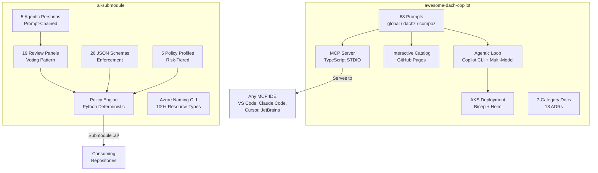

---

## 3. Capability Matrix

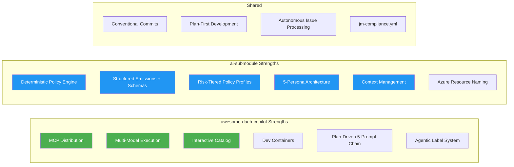

---

## 4. Benefits

### awesome-dach-copilot

| Benefit | Detail |
|---------|--------|
| **MCP Distribution** | Serves prompts to any MCP-compatible IDE via `npx` or Docker. Multi-IDE reach without requiring submodule setup. |
| **Multi-Model Execution** | Agentic loop supports Claude Opus 4.6, Sonnet 4, GPT-5-mini, GPT-4.1. Model selection per task type. |
| **Interactive Catalog** | Searchable GitHub Pages dashboard with maturity visualization. Lowers prompt discoverability barrier. |
| **High Automation Velocity** | 830+ issues processed, 3:1 bot-to-human commit ratio. Weekly releases. |
| **Plan-Driven 5-Prompt Chain** | create → review → refine → execute → complete with multi-model validation. |
| **Dev Containers** | Pre-configured with corporate CA certs and post-create scripts. Zero-friction onboarding. |
| **Agentic Label System** | Clean state machine: `agentic-ready` → `agentic-in-progress` → `agentic-feedback-needed`. |

### ai-submodule

| Benefit | Detail |
|---------|--------|
| **Deterministic Policy Engine** | Confidence-weighted panel aggregation. Machine-evaluates structured emissions. Produces auditable merge decisions. |
| **Structured Emissions** | JSON output validated against schemas between `STRUCTURED_EMISSION_START/END` markers. Machine-readable, auditable. |
| **Risk-Tiered Profiles** | `default`, `fin_pii_high` (SOC2/PCI-DSS/HIPAA/GDPR), `infrastructure_critical`, `reduced_touchpoint`. |
| **5-Persona Architecture** | DevOps → Code Manager → Coder → IaC Engineer → Tester with typed inter-agent protocol. |
| **Context Management** | 4-tier JIT loading, 80% capacity hard stop, checkpoint/resumption. Prevents context overflow. |
| **Version-Pinned Governance** | Git submodule guarantees consuming repos get the exact governance version they pin to. |
| **Azure Naming** | 100+ resource types, deterministic shortening, JM convention compliance. |
| **26 JSON Schemas** | Enforcement artifacts for panel output, manifests, baselines, autonomy metrics, conflict detection, formal specs. |

---

## 5. Problems

### awesome-dach-copilot

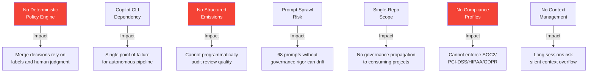

### ai-submodule

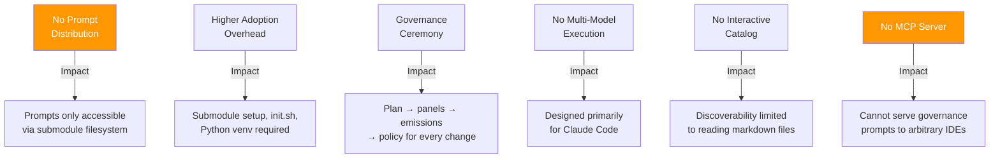

---

## 6. Adoption Recommendation

### From awesome-dach-copilot — adopt into ai-submodule:

1. **MCP Server distribution** — Serve review prompts and governance tools to any IDE
2. **Interactive catalog + GitHub Pages dashboard** — Visual discoverability for panels and policies
3. **Multi-model agentic execution** — Resilience via multiple LLM backends
4. **Plan-driven 5-prompt chain** — Richer plan lifecycle than current template
5. **Agentic label system** — Visible state machine for issue processing
6. **Dev containers** — Zero-friction onboarding for new contributors

### From ai-submodule — retain and strengthen:

1. **Deterministic policy engine** — Non-negotiable for trustworthy autonomy
2. **Structured emissions with schema validation** — Auditable, enforceable governance
3. **Risk-tiered policy profiles** — SOC2/PCI-DSS/HIPAA/GDPR compliance
4. **5-persona agentic architecture** — Architecturally superior to Copilot CLI loops
5. **Context management** — Essential for reliable long-running sessions
6. **Submodule distribution** — Version-pinned governance enforcement
7. **Azure resource naming** — Enterprise-specific value

---

## 7. Integration Driver

**The ai-submodule should be the driver.**

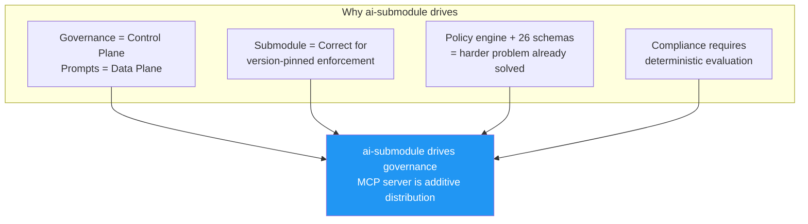

**Rationale:**
- Governance is the control plane; prompts are the data plane. You can add distribution to governance; you cannot retroactively add deterministic enforcement to a prompt library.
- Submodule distribution is structurally correct for governance — consuming repos pin to a version.
- The ai-submodule has the harder problem solved (policy engine, schemas, personas). An MCP server is additive.
- SOC2/PCI-DSS/HIPAA/GDPR compliance demands auditable, deterministic policy evaluation.

---

## 8. Integration Plan

### Phase Overview

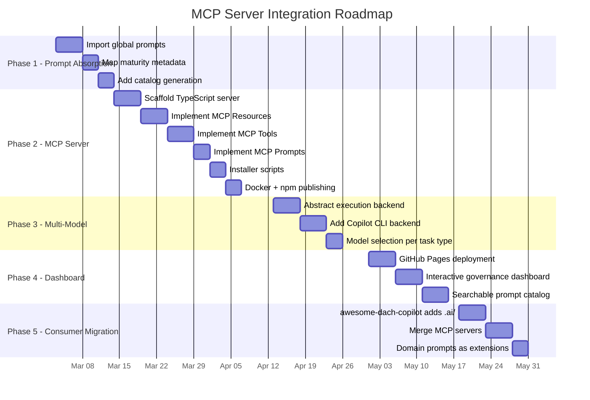

### Phase 1: Prompt Absorption

**Goal:** Import awesome-dach-copilot's reusable prompts into ai-submodule.

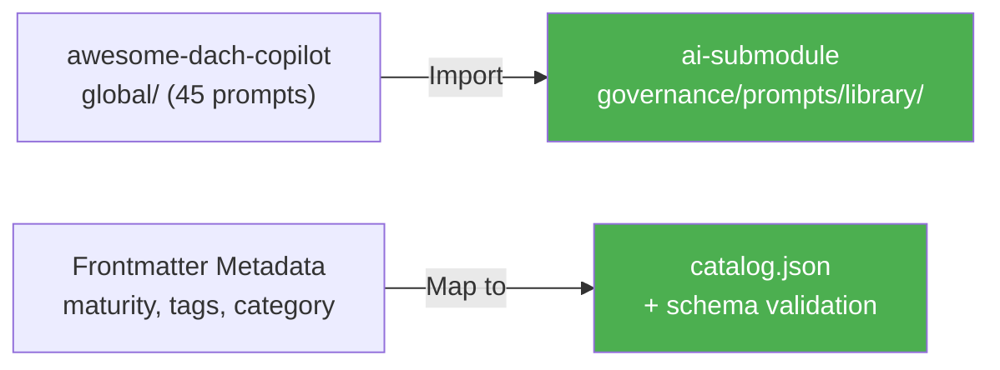

**Tasks:**
1. Create `governance/prompts/library/` for imported prompts
2. Import `global/` prompts from awesome-dach-copilot (skip `dachz/` and `compoz/` — those are domain-specific)
3. Map prompt maturity statuses (Production/Beta/Concept) to ai-submodule schema metadata
4. Add `catalog.json` generation script to `governance/bin/`
5. Validate catalog against a new `governance/schemas/catalog.schema.json`

**What stays in awesome-dach-copilot:** `dachz/` and `compoz/` prompts (team-specific), AKS deployment configs, presentation materials.

### Phase 2: MCP Server (Issue #424)

**Goal:** TypeScript STDIO MCP server distributing governance prompts and tools.

```mermaid
flowchart TB
    subgraph "MCP Server (mcp-server/)"
        direction TB
        INDEX["index.ts<br/>Server entry point"]
        RESOURCES["resources.ts<br/>Resource registration"]
        TOOLS["tools.ts<br/>Tool registration"]
        PROMPTS_MCP["prompts.ts<br/>Prompt registration"]
        INSTALL["install.ts<br/>Multi-IDE installer"]
    end

    subgraph "MCP Resources (read-only)"
        R1["19 Review Panels"]
        R2["10 Workflow Templates"]
        R3["5 Persona Definitions"]
        R4["Shared Perspectives"]
        R5["Policy Profile Summaries"]
        R6["Imported Prompt Library"]
    end

    subgraph "MCP Tools (executable)"
        T1["validate_emission<br/>Schema validation"]
        T2["check_policy<br/>Policy engine dry-run"]
        T3["generate_name<br/>Azure naming CLI"]
        T4["list_panels<br/>Panel metadata"]
        T5["list_policy_profiles<br/>Profile descriptions"]
    end

    subgraph "MCP Prompts (invocable)"
        MP1["governance_review<br/>Run a review panel"]
        MP2["plan_create<br/>Generate plan from template"]
        MP3["threat_model<br/>Run threat model"]
    end

    RESOURCES --> R1 & R2 & R3 & R4 & R5 & R6
    TOOLS --> T1 & T2 & T3 & T4 & T5
    PROMPTS_MCP --> MP1 & MP2 & MP3

    subgraph "Distribution"
        NPM["npx @jm-packages/<br/>ai-submodule-mcp"]
        DOCKER["Docker GHCR<br/>ghcr.io/set-apps/<br/>ai-submodule-mcp"]
        INSTALLER["install.sh / install.ps1<br/>Auto-configure IDEs"]
    end

    INDEX --> NPM & DOCKER
    INSTALL --> INSTALLER
```

**Tasks:**
1. Scaffold `mcp-server/` with TypeScript, `@modelcontextprotocol/sdk`, `zod`, `gray-matter`
2. Implement resource serving for all review prompts, workflows, personas, and library prompts
3. Implement tools wrapping the policy engine (`python governance/bin/policy-engine.py`) and naming CLI
4. Implement prompts for governance review, plan creation, and threat modeling
5. Build multi-IDE installer scripts (Claude Code `~/.claude.json`, VS Code `settings.json`, Cursor)
6. Publish to npm (`@jm-packages/ai-submodule-mcp`) and GHCR
7. Add manifest-based integrity tracking (content hashes per resource)
8. Update `init.sh` with `--install-mcp` flag

**Key constraint:** The MCP server is a **distribution layer only**. It does not replace the policy engine or submodule enforcement. Consuming repos with the submodule still get full governance; the MCP server provides access to repos that don't have it.

### Phase 3: Multi-Model Execution

**Goal:** Abstract the agentic loop to support multiple LLM backends.

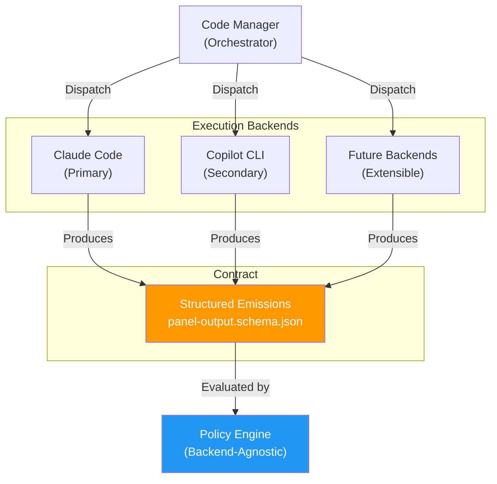

**Tasks:**
1. Define execution backend interface (input: issue context + plan; output: structured emission)
2. Refactor Coder persona dispatch to use backend abstraction
3. Add Copilot CLI backend (leveraging awesome-dach-copilot's agentic loop pattern)
4. Implement model selection per task type in `project.yaml` configuration
5. Structured emissions remain the universal contract — backend-agnostic

### Phase 4: Dashboard & Catalog

**Goal:** Interactive governance dashboard and searchable prompt catalog on GitHub Pages.

**Tasks:**
1. Add `mkdocs` GitHub Pages deployment workflow (already has `mkdocs.yml`)
2. Build interactive governance dashboard showing panel results, policy decisions, autonomy metrics
3. Add searchable prompt/panel catalog with maturity visualization
4. Agentic workflow visualization (session timelines, agent interactions)
5. Adopt awesome-dach-copilot's synthwave aesthetic for diagrams (optional)

### Phase 5: Consumer Migration

**Goal:** awesome-dach-copilot becomes a governed consumer of ai-submodule.

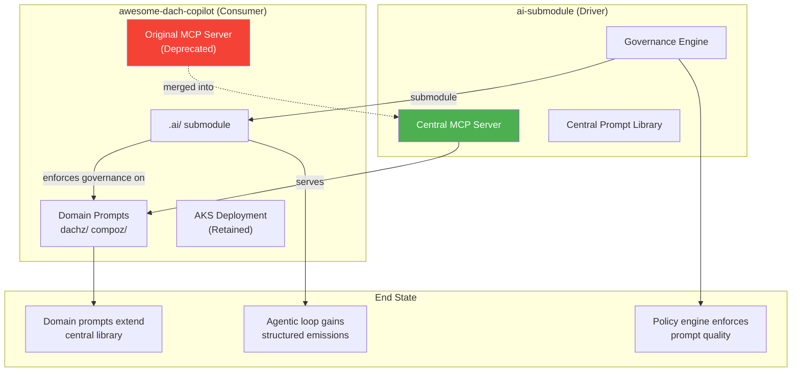

**Tasks:**
1. awesome-dach-copilot adds `.ai/` submodule and runs `init.sh`
2. Its prompts gain structured emission tracking and policy evaluation
3. Domain-specific prompts (`dachz/`, `compoz/`) register as extensions in `project.yaml`
4. Original MCP server (`@jm-packages/dach-prompts`) deprecated in favor of central MCP server
5. Central MCP server serves domain extensions alongside governance prompts

---

## 9. End-State Architecture

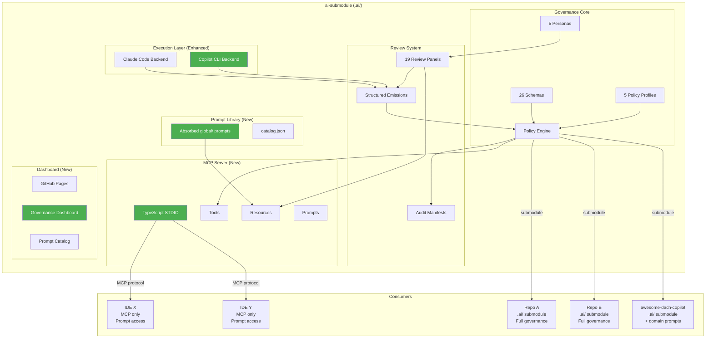

---

## 10. Risk Assessment

| Risk | Likelihood | Impact | Mitigation |
|------|-----------|--------|------------|
| MCP server becomes a governance bypass vector | Medium | High | MCP is read-only distribution. Policy enforcement remains in submodule + CI. MCP `check_policy` is dry-run only. |
| Prompt absorption creates maintenance burden | Low | Medium | Automated catalog generation validates on every commit. Maturity model gates promotion. |
| Multi-model execution produces inconsistent emissions | Medium | Medium | Structured emission schema is the contract. Schema validation rejects non-conforming output regardless of backend. |
| awesome-dach-copilot team resists migration | Low | Low | Migration is additive — they keep domain prompts and AKS infra. Governance adds value without removing capabilities. |
| MCP server dependency on policy engine subprocess | Low | Medium | Graceful degradation: if Python/policy engine unavailable, tools return error; resources still served. |

---

## 11. Summary

| Decision | Choice | Rationale |
|----------|--------|-----------|
| **Driver** | ai-submodule | Governance (control plane) drives; prompts (data plane) are additive |
| **Distribution** | MCP Server + Submodule (dual) | Submodule for enforcement, MCP for IDE-agnostic access |
| **Prompt Source** | Absorb awesome-dach-copilot's `global/` | Reusable prompts belong in the governance framework |
| **Domain Prompts** | Stay in awesome-dach-copilot | Team-specific prompts don't belong in governance |
| **Policy Engine** | Unchanged (Python, deterministic) | Non-negotiable for compliance |
| **Agentic Loop** | Extend to multi-model | Claude Code primary, Copilot CLI secondary |
| **awesome-dach-copilot fate** | Becomes governed consumer | Adds `.ai/` submodule, retains domain extensions |
