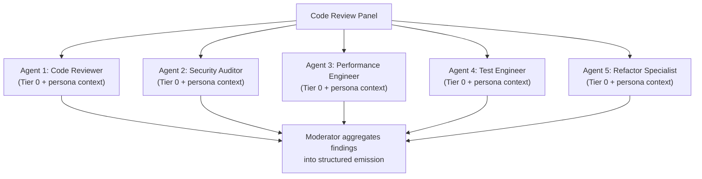
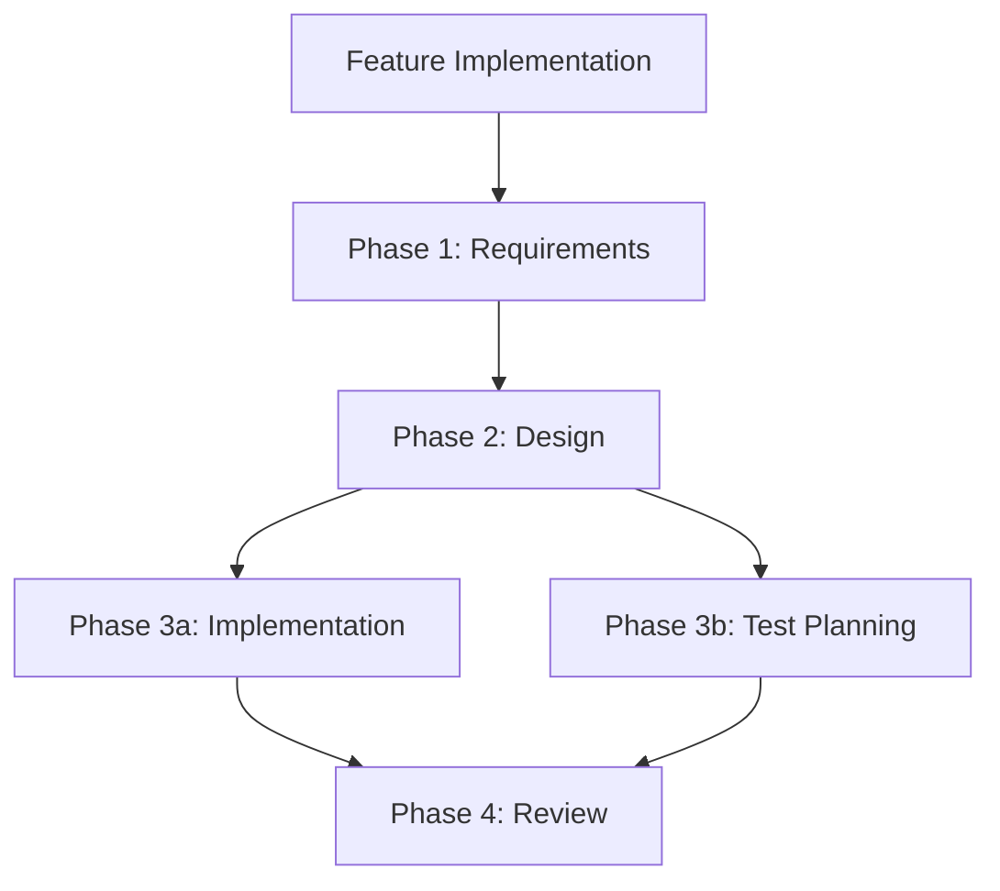

# Context Management and JIT Loading Strategy

## Problem

AI agents have finite context windows. Loading all personas, prompts, workflows, policies, and instructions simultaneously wastes context capacity, reduces reasoning quality, and risks context resets that lose critical guidance. The Dark Factory system contains 15,000+ lines of Markdown — loading everything is neither feasible nor desirable.

## Design Principles

1. **Load what you need, when you need it** — JIT loading based on task phase
2. **Never lose critical instructions** — Base instructions survive context resets
3. **Maximize parallel execution** — Independent agents work with minimal shared context
4. **Decompose for reuse** — Small, composable instruction units over monolithic files
5. **Context budget enforcement** — Hard limits on what gets loaded per phase

## Context Tiers

### Tier 0: Persistent Context (Always Loaded)

Content that must survive context resets. Kept minimal.

| Content | Source | Max Tokens |
|---------|--------|------------|
| Base instructions | `instructions.md` | 200 |
| Project identity | `project.yaml` (name, language, framework only) | 100 |
| Active governance profile | Profile name + decision thresholds only | 50 |
| Current task reference | Issue/DI ID + objective statement | 50 |

**Total Tier 0 budget: ~400 tokens**

Design rule: If `instructions.md` exceeds 500 tokens, decompose it. The base file must contain only universal principles. Everything else belongs in Tier 1 or 2.

### Tier 1: Session Context (Loaded at Session Start)

Content loaded once when an agent begins a task session. Stays in context for the session duration.

| Content | Source | Loaded When |
|---------|--------|-------------|
| Language conventions | `governance/templates/{language}/instructions.md` | Session start, based on `project.yaml` language |
| Active persona set | Persona files listed in `project.yaml` | Session start |
| Current plan | `.governance/plans/{active-plan}.md` | Session start if plan exists |

**Total Tier 1 budget: ~2,000 tokens**

Design rule: If the persona set exceeds the budget, load only the persona headers (Role + Evaluate For sections). Full persona content moves to Tier 2.

### Tier 2: Phase Context (Loaded Per Workflow Phase)

Content loaded and unloaded as the agent moves through workflow phases. Previous phase context is released.

| Content | Source | Loaded When |
|---------|--------|-------------|
| Workflow phase definition | `governance/prompts/workflows/{workflow}.md` (single phase) | Phase entry |
| Phase-specific prompt | `governance/prompts/{prompt}.md` | When the phase invokes it |
| Panel definition | `governance/prompts/reviews/{panel}.md` | Panel invocation |

**Total Tier 2 budget: ~3,000 tokens**

Design rule: Workflow files must be decomposable by phase. Each phase section should work independently without requiring the full workflow in context.

### Tier 3: Reference Context (Never Loaded, Queried On-Demand)

Content accessed via tool calls or file reads, never pre-loaded.

| Content | Source | Access Method |
|---------|--------|--------------|
| Policy profiles | `governance/policy/*.yaml` | Programmatic evaluation |
| JSON schemas | `governance/schemas/*.schema.json` | Schema validation tool |
| Run manifests | `governance/manifests/*.json` | File read on-demand |
| Architecture docs | `docs/**/*.md` | File read when referenced |
| Review prompts | `governance/prompts/reviews/*.md` not in active set | File read when invoked |

**Tier 3 budget: 0 tokens (no context cost)**

## Tier Budget Exceptions

Some prompts intentionally exceed their assigned tier budget. These exceptions are documented here with rationale. Prompts not listed below must stay within their tier budget.

### Documented Exceptions

| Prompt | Tier | Budget | Actual | Rationale |
|--------|------|--------|--------|-----------|
| `governance/prompts/startup.md` | 0+1 | ~2,400 tokens | ~4,700 tokens | Contains the full agentic loop with ANCHOR section that must survive context resets. Splitting into phases would fragment the critical shutdown protocol and risk lost instructions on context compaction. Loaded once at session start; not reloaded during the session. |
| `governance/prompts/reviews/threat-modeling.md` | 2 | ~3,000 tokens | ~5,350 tokens | Self-contained review prompt implementing Anthropic's Parallelization (Voting) pattern. Inlines 5 threat perspectives with full evaluation criteria. Splitting would break prompt locality — each perspective needs access to all others for cross-referencing. Loaded only during threat-modeling panel execution. |
| `governance/prompts/reviews/security-review.md` | 2 | ~3,000 tokens | ~3,400 tokens | Self-contained review prompt with 5 security perspectives. Marginally over budget. Same locality rationale as threat-modeling. |

### When Exceptions Are Acceptable

An exception is justified when:
1. **Splitting would degrade output quality** — the prompt relies on cross-referencing between sections
2. **The prompt implements a recognized AI pattern** (Parallelization, Voting) that requires locality
3. **The prompt contains ANCHOR content** that must survive context resets
4. **The prompt is loaded infrequently** — exceeding budget on a rarely-loaded prompt has less impact than on a frequently-loaded one

### When Exceptions Are NOT Acceptable

Do not add exceptions for:
- Prompts that can be decomposed without quality loss
- Prompts loaded at multiple tiers simultaneously
- Instructional content that could move to Tier 3 (on-demand)

> **Note:** Token counts are approximate (1 token ≈ 4 characters) and tied to the prompt content at the time of this documentation. Counts may drift as prompts evolve.

## Instruction Decomposition

### Current Problem

Monolithic instruction files force full loading even when only a fraction is relevant. A 2,000-token `instructions.md` wastes 1,800 tokens when only the base principles apply.

### Decomposition Strategy

Split instructions into composable units:

```
instructions.md                  (Tier 0 — universal principles, < 200 tokens)
instructions/
  code-quality.md               (Tier 1 — loaded for code tasks)
  testing.md                    (Tier 1 — loaded for test tasks)
  security.md                   (Tier 1 — loaded for security-sensitive tasks)
  communication.md              (Tier 1 — loaded for PR/issue tasks)
  governance.md                 (Tier 1 — loaded for governance tasks)
```

Each decomposed file:
- Has a clear, single responsibility
- Is under 500 tokens
- Can be loaded independently
- Has no dependencies on other decomposed files

### Persona Decomposition

Personas are already well-decomposed (one file per persona). Optimization:

1. **Header extraction**: For Tier 1 loading, extract only `## Role` and `## Evaluate For` (~100 tokens per persona vs. ~400 for the full file)
2. **Full load on invocation**: Load the complete persona only when it is actively executing a review
3. **Panel optimization**: Load only the moderator pattern and persona names; load individual personas as they speak

### Workflow Phase Decomposition

Workflows must support phase-level loading. Convention:

```markdown
<!-- PHASE:1 -->
## Phase 1: Requirements Analysis
...
<!-- /PHASE:1 -->

<!-- PHASE:2 -->
## Phase 2: Design
...
<!-- /PHASE:2 -->
```

The agent loader extracts only the current phase section, keeping previous phases out of context. Phase artifacts (e.g., `[FEAT-1]`) are passed forward as compact references, not full content.

## Parallel Execution Model

### Agent Independence

Each parallel agent receives:
- Tier 0 context (identical across all agents)
- Its own Tier 1 context (specific to its role)
- Its own Tier 2 context (specific to its current phase)

No shared mutable state between agents. Results are aggregated by the Code Manager after all agents complete.

### Panel Parallelism

Panels can execute personas in parallel:



Each persona agent:
- Loads only Tier 0 + its own persona definition + the code diff
- Produces independent findings
- Has no dependency on other persona agents
- Can be terminated independently on timeout

### Workflow Parallelism

Independent workflow phases can execute in parallel:



## Capacity Tiers

The pipeline uses a four-tier capacity model to govern phase transitions, Coder dispatch, and shutdown decisions. Tier classification uses the highest tier indicated by any single signal.

### Tier Definitions

| Tier | Capacity Range | Label | Color | Behavior |
|------|---------------|-------|-------|----------|
| 1 | < 60% | **Green** | Safe | Normal operation. All phases proceed. New Coder dispatches allowed. |
| 2 | 60-70% | **Yellow** | Caution | No new Coder dispatches. Finish in-flight work only. Proactively summarize context to extend the working window. |
| 3 | 70-80% | **Orange** | Warning | Stop after current PR completes (if mid-Phase 4). Write checkpoint and request `/clear`. Do not start new phases. |
| 4 | >= 80% | **Red** | Critical | Stop immediately. Emergency checkpoint. Do not finish current step. Execute full Shutdown Protocol. |

### Signal-to-Tier Mapping

Each signal maps independently to a tier. The agent's current tier is the **maximum** across all signals.

| Signal | Green (< 60%) | Yellow (60-70%) | Orange (70-80%) | Red (>= 80%) |
|--------|---------------|-----------------|-----------------|---------------|
| Tool calls in session | < 40 | 40-55 | 55-80 | > 80 |
| Chat turns (exchanges) | < 60 | 60-100 | 100-150 | > 150 |
| Issues completed (N = `parallel_coders`; N/A when N = -1) | < N-2 | N-2 | N-1 | N (cap reached) |
| Claude Code token counter | < 60% shown | 60-70% shown | 70-80% shown | >= 80% shown |
| Copilot context meter | < 60% shown | 60-70% shown | 70-80% shown | >= 80% shown |
| Copilot character count | < 150K chars | 150-200K chars | 200-250K chars | > 250K chars |
| Degraded recall (re-reading files, inconsistent output) | — | — | — | Red (any occurrence) |
| System warnings about context limits | — | — | — | Red (any occurrence) |
| Automatic summarization observed | — | — | — | Red (any occurrence) |

**Degraded recall, system warnings, and automatic summarization are always Red** — they indicate context is already under pressure and immediate action is required.

### Tier Transition Rules

- Tiers only escalate upward during a session (Green -> Yellow -> Orange -> Red). Context capacity does not recover within a session.
- The agent must re-evaluate tier classification at every phase boundary via the Context Gate protocol.
- A single signal reaching a higher tier is sufficient to escalate. The agent does not wait for multiple signals to agree.

### Unlimited Mode (parallel_coders = -1)

When `governance.parallel_coders` is set to -1 in `project.yaml`, the pipeline operates in **unlimited mode**:

- The "Issues completed" signal row in the Signal-to-Tier Mapping table is ignored entirely. It does not contribute to tier classification.
- There is no issue count cap. The pipeline processes all actionable issues across as many loop iterations as needed.
- The four-tier capacity model (Green/Yellow/Orange/Red) is the **sole mechanism** for session termination. Tool call count, turn count, token counters, degraded recall, and system warnings remain active and authoritative.
- Parallel dispatch spawns agents for all planned issues (still subject to the context gate at Phase 3 entry).

**When to use unlimited mode:** Projects with many small, independent issues benefit from unlimited mode because Coder subagents run in their own context windows and do not consume the main session's budget. The main session's context pressure comes from orchestration overhead (planning, evaluation, PR monitoring), not from Coder execution.

**Concurrency note:** Unlimited mode removes the *session-level* issue count cap, not the *simultaneous* concurrency limit. The number of worktrees spawned per batch is still bounded by available actionable issues and the context gate at Phase 3 entry. In practice, most sessions process 5-15 issues before context pressure from orchestration overhead (planning, evaluation, PR monitoring) triggers a checkpoint. Each worktree consumes disk space (~1x repo size) and a subprocess, so very large batches on resource-constrained machines may hit system limits before context limits.

**Risk mitigation:** Unlimited mode does not disable safety mechanisms. The four-tier capacity model, mandatory context gates at every phase boundary, and the shutdown protocol all remain fully enforced. The only change is that issue count alone cannot trigger a shutdown.

### Auto-Clear for Continuous Operation

Full auto-clear (automatic context resets without human intervention) requires external tooling because current AI platforms do not support programmatic self-initiated context resets. The pipeline's checkpoint and Phase 0 recovery handle the agent-side logic; the reset trigger must come from outside the session.

**Claude Code:** Use a shell wrapper to restart the agent after each session exit:

```bash
MAX_RETRIES=50
RETRY_COUNT=0
while [ "$RETRY_COUNT" -lt "$MAX_RETRIES" ]; do
  START_TIME=$(date +%s)
  claude --prompt "/startup"
  EXIT_CODE=$?
  ELAPSED=$(( $(date +%s) - START_TIME ))

  # If session ran for less than 30 seconds, it likely errored — back off
  if [ "$ELAPSED" -lt 30 ]; then
    RETRY_COUNT=$((RETRY_COUNT + 1))
    echo "Session exited quickly (${ELAPSED}s, exit $EXIT_CODE). Backing off (attempt $RETRY_COUNT/$MAX_RETRIES)..."
    sleep $((RETRY_COUNT * 5))
  else
    RETRY_COUNT=0  # Reset on successful session
    echo "Session ended normally. Restarting..."
  fi
done
echo "Max retries reached. Exiting wrapper."
```

Each invocation starts a fresh context window. Phase 0 auto-detects the checkpoint written by the previous session's shutdown protocol and resumes where it left off. The shell wrapper provides the external restart trigger that the agent cannot provide for itself. The backoff logic prevents tight spin loops if the agent exits immediately (e.g., auth failure, rate limit).

**GitHub Copilot:** Auto-clear is not programmatically available. When the agent's shutdown protocol triggers, the user must manually start a new chat thread and paste the checkpoint path. Document this process in team onboarding materials. Future Copilot API extensions may enable programmatic thread creation.

**General principle:** The agent writes checkpoints and requests a reset. An external mechanism (shell loop, CI workflow, or human) performs the reset. Phase 0 recovery bridges the gap. This separation ensures the agent never operates in a degraded context state.

## Phase Boundary Gate Protocol

Every pipeline phase (1-5) begins with a mandatory Context Gate check. This ensures context capacity is evaluated at structured intervals, not just when symptoms appear.

### Gate Execution

At each phase boundary, the active persona executes:

1. **Evaluate all capacity signals** — check tool call count, turn count, issues completed, and platform-specific token indicators
2. **Classify current tier** — use the Signal-to-Tier Mapping table; take the maximum tier across all signals
3. **Act on tier:**

| Current Tier | Phase 1 (Pre-flight) | Phase 2 (Planning) | Phase 3 (Dispatch) | Phase 4 (Review) | Phase 5 (Merge) |
|-------------|---------------------|-------------------|-------------------|-----------------|----------------|
| **Green** | Proceed | Proceed | Dispatch all | Proceed | Merge + loop |
| **Yellow** | Proceed | Proceed | Skip new dispatches; Phase 4 for in-flight only | Finish in-flight PRs; no new dispatches | Merge; do NOT loop |
| **Orange** | Shutdown | Shutdown | Shutdown | Complete current PR only, then shutdown | Shutdown (leave PRs open) |
| **Red** | Shutdown | Shutdown | Shutdown | Shutdown immediately | Shutdown immediately |

4. **Log gate result** — record the gate evaluation in checkpoint metadata for audit:

```json
{
  "context_gate": {
    "phase": 3,
    "tier": "yellow",
    "tool_calls": 47,
    "turn_count": 82,
    "issues_completed": 3,
    "platform": "claude-code",
    "action": "skip-dispatch"
  }
}
```

### Gate Actions

| Action | Meaning |
|--------|---------|
| `proceed` | Enter the phase normally |
| `skip-dispatch` | Enter Phase 3 but do not spawn new Coder agents; proceed to Phase 4 for in-flight work |
| `finish-current` | Complete the current PR in Phase 4, then execute Shutdown Protocol |
| `merge-no-loop` | Execute Phase 5 merge but do not loop back to Phase 1 |
| `checkpoint` | Execute Shutdown Protocol: clean git, write checkpoint, request `/clear` |
| `emergency-stop` | Execute Shutdown Protocol immediately without finishing current step |

### Platform-Specific Gate Detection

#### Claude Code

Claude Code provides direct token usage visibility:

- **Token counter** (verbose mode): Displayed on the right side of the terminal. Shows `{used}/{total}` tokens. Divide to get the capacity percentage.
- **System warnings**: Emitted as system messages when approaching context limits. Any system warning is an automatic Red classification.
- **Automatic summarization**: When Claude Code summarizes earlier messages mid-conversation, this indicates Red tier. Checkpoint immediately.
- **Tool call tracking**: The agent must maintain an internal count of tool calls made during the session. This is the most reliable cross-platform heuristic.

#### GitHub Copilot

Copilot requires a combination of API access and heuristics:

- **Context meter** (VS Code Chat): Hover the token indicator in the chat input area for exact counts (e.g., `15K/128K`). Calculate percentage directly.
- **`vscode.lm.countTokens()` API**: For extension-based agents, count tokens on the assembled payload before each request. Compare against the model's context window size.
- **Character count heuristic**: When API access is unavailable, estimate tokens from total conversation character count (1 token ~ 4 characters).
- **Turn count heuristic**: Track back-and-forth exchanges. This is always available regardless of API access.
- **Auto-summarization**: If VS Code auto-summarizes conversation history, classify as Red immediately.

#### Universal Heuristics (All Platforms)

These signals are always available and do not depend on platform-specific APIs:

| Heuristic | How to Track | Notes |
|-----------|-------------|-------|
| Tool call count | Increment on each tool invocation | Most reliable universal signal |
| Turn count | Increment on each assistant response | Correlates with context consumption |
| Issues completed | Count merged PRs + resolved PRs | Tracked by the pipeline naturally |
| Degraded recall | Detect re-reading of previously-read files, contradictory decisions | Self-detection; always Red |

## Context Reset Protection

### The Reset Problem

When a context window fills, the AI runtime may truncate or summarize early context. This risks losing:
- Base instructions (Tier 0)
- Active persona definitions (Tier 1)
- Governance constraints

Uncontrolled compaction is the worst outcome. If the context compacts while the working tree has uncommitted changes, merge conflicts, or in-progress operations, the agent loses both the instructions that explain what it was doing and the ability to recover cleanly. This must never happen.

### Context Pressure Detection (Platform-Specific)

The agent must actively monitor for context pressure using platform-specific signals:

#### Claude Code
- **Token counter**: Visible in `--verbose` mode on the right side of the terminal. Shows current token usage vs. model context window.
- **System warnings**: Claude Code emits warnings when approaching context limits. These appear as system messages in the conversation.
- **Automatic summarization**: When Claude Code summarizes earlier messages, this is a signal that context is already under pressure. If this happens mid-task, immediately checkpoint.

#### GitHub Copilot (VS Code)

Copilot does not expose per-request token usage via a public API the way OpenAI-style APIs do. Detection relies on a combination of UI signals, the VS Code Language Model API, and heuristic estimation.

**Primary: VS Code Language Model API (Extensions)**

If operating as a VS Code extension or chat participant, use the Language Model API for token counting:

```typescript
import * as vscode from "vscode";

// Window size depends on mode: 128k for Insiders, 64k for standard
const MODEL_WINDOW = parseInt(process.env.COPILOT_CONTEXT_WINDOW ?? "64000", 10);
const CHECKPOINT_THRESHOLD = 0.70; // Don't start new issues above this
const HARD_STOP_THRESHOLD = 0.80;  // Stop immediately, execute shutdown protocol

async function checkContextCapacity(payloadText: string) {
  const tokens = await vscode.lm.countTokens(payloadText);
  const ratio = tokens / MODEL_WINDOW;
  if (ratio >= HARD_STOP_THRESHOLD) return { action: "shutdown", ratio, tokens };
  if (ratio >= CHECKPOINT_THRESHOLD) return { action: "checkpoint", ratio, tokens };
  return { action: "continue", ratio, tokens };
}
```

**Track what you send**: system instructions + conversation summary + recent turns + selected context (files/snippets). Call `countTokens()` on the assembled payload before each request.

**Secondary: UI Context Meter (Interactive Sessions)**

In Copilot Chat (VS Code), a token usage indicator appears in the chat input area. Hovering it shows an exact token count (e.g., `15K/128K`) with a category breakdown (chat history, files, instructions, etc.). Monitor this meter:
- **Below 70%**: Continue normally.
- **70-80%**: Do not start new issues. Finish current work, write checkpoint, and proactively summarize context to stay below 80%. Use rolling summaries to extend the useful working window.
- **At/above 80%**: Hard stop. Execute the full Capacity Shutdown Protocol immediately (stop, clean git, write checkpoint, request context reset via new thread).

**Note**: VS Code automatically summarizes conversation history when the context fills. If you observe auto-summarization happening, context is already under pressure — immediately checkpoint.

**Secondary: Heuristic Estimation (When API Unavailable)**

When operating as a Copilot agent without direct access to `vscode.lm.countTokens()`:

| Signal | Threshold | Action |
|--------|-----------|--------|
| Chat turns (back-and-forth) | > 30 turns | Assume 70%+ capacity. Monitor closely. |
| Character count of conversation | > 200,000 chars | Assume ~50K tokens (~80% of 64K window). Checkpoint. |
| Files in context | > 10 files referenced | Significant context consumption. Review necessity. |
| Response quality degradation | Suggestions become generic or lose project context | Context pressure likely. Checkpoint immediately. |
| Response truncation | Responses cut short mid-sentence or lose coherence | Near or at capacity. Execute hard reset. |
| Re-reading files | Agent re-reads files it already processed | Context has been compacted. Checkpoint immediately. |

**Copilot-Specific Context Window Sizes:**

| Mode | Model | Context Window |
|------|-------|----------------|
| VS Code Copilot Chat | GPT-4o | 64K tokens |
| VS Code Insiders | GPT-4o | 128K tokens |
| GitHub.com Copilot Chat | GPT-4o | 64K tokens |
| Copilot in CLI | Varies | Check model-specific limits |

**Copilot Shutdown Protocol:**

Copilot agents follow the same two-tier threshold system as Claude Code:

- **At 70%**: Do not start new issues. Finish current work, checkpoint. Proactively summarize context to extend the working window.
- **At 80%**: Hard stop. Execute the full Capacity Shutdown Protocol (steps 1-5 below) immediately.

Copilot-specific adaptations:

1. **Context reset**: Instead of `/clear`, start a new Copilot Chat thread. Copilot does not have a `/clear` equivalent — a new thread is the reset mechanism.
2. **Checkpoint handoff**: In the new thread, paste: "Resume from checkpoint: `.governance/checkpoints/{file}`" so the agent reads the checkpoint and continues.
3. **Proactive summarization** (between 60-70%): Create rolling summaries of completed work and drop older raw turns. This extends the useful working window. VS Code auto-summarization also helps, but the agent should summarize proactively rather than waiting for the system to do it.

#### Universal Heuristics (All Platforms)
- **Issue count**: After N completed issues (N = `governance.parallel_coders`, default 5), stop regardless of token count. When N = -1, this heuristic is disabled — context pressure from the remaining signals governs session termination.
- **Tool call count**: After ~50 tool calls in a session, assume 70%+ capacity.
- **Conversation exchanges**: After ~100 back-and-forth exchanges, assume 70%+ capacity.
- **Self-detection**: If the agent re-reads files it already read, forgets earlier decisions, or produces contradictory output, context pressure is the likely cause.

**The user should never have to manage context.** The agent is responsible for detecting pressure and executing the shutdown protocol before the user notices any degradation.

### Capacity Shutdown Protocol

**This is the primary defense against context loss. It is mandatory and overrides all other work.**

The agent must check context capacity before starting any new issue, and after completing each major step (plan, implement, review, merge). When context reaches 80% capacity or any detection signal triggers:

1. **Stop immediately** — do not start the next task, issue, or step
2. **Clean all git state**:
   - Run `git status` on every branch touched in the session
   - Commit any pending changes with a `wip:` prefix if needed
   - Abort any in-progress merges (`git merge --abort`) or rebases (`git rebase --abort`)
   - Verify `git status` shows `nothing to commit, working tree clean`
3. **Write a checkpoint** to `.governance/checkpoints/{timestamp}-{branch}.json`:
   ```json
   {
     "timestamp": "2026-02-21T14:30:00Z",
     "branch": "NETWORK_ID/current-branch",
     "issues_completed": ["#5", "#6"],
     "issues_remaining": ["#7", "#8"],
     "current_issue": null,
     "current_step": "Completed Phase 4 for issue #6",
     "git_state": "clean",
     "pending_work": "Issues #7 and #8 need implementation. PRs #13-#15 need governance approval.",
     "prs_created": ["#13", "#14", "#15"],
     "manifests_written": ["20260221-143000-abc1234"],
     "branches_touched": ["NETWORK_ID/5-agile-coach", "NETWORK_ID/6-finops-group"],
     "context_capacity": {
       "tier": "red",
       "tool_calls": 83,
       "turn_count": 47,
       "issues_completed_count": 2,
       "platform": "claude-code",
       "trigger": "tool_calls > 80 (Red threshold)"
     },
     "context_gates_passed": [
       {"phase": 1, "tier": "green", "action": "proceed"},
       {"phase": 2, "tier": "green", "action": "proceed"},
       {"phase": 3, "tier": "yellow", "action": "skip-dispatch"},
       {"phase": 4, "tier": "orange", "action": "finish-current"}
     ]
   }
   ```
   The `context_capacity` object records the state at shutdown. The `context_gates_passed` array records every gate evaluation during the session, providing an audit trail of capacity decisions.
4. **Report to user** — summarize what was completed, what remains, and the checkpoint file path
5. **Request context reset** — tell the user to run `/clear` and provide the checkpoint path for the next session to read

### Checkpoint Recovery

When resuming from a checkpoint:
1. Read the checkpoint file referenced by the user
2. Verify git state matches the checkpoint (`git branch`, `git status`)
3. Load only the Tier 1 + Tier 2 context needed for the next pending task
4. Continue from where the checkpoint left off

### Auto-Restart After Context Reset

The agentic loop supports automatic resumption after a context reset. This eliminates manual re-orientation and allows the agent to pick up exactly where it left off with minimal user intervention.

#### Flow

```
Session N (context pressure detected)
  └─ Shutdown Protocol writes checkpoint to .governance/checkpoints/
  └─ Agent tells user to run /clear (Claude Code) or start new thread (Copilot)

Session N+1 (after context reset)
  └─ User runs /startup (or pastes checkpoint path in Copilot)
  └─ Phase 0: Checkpoint Auto-Recovery
       ├─ Scans .governance/checkpoints/ for most recent JSON file
       ├─ Validates all referenced issues are still open (gh issue view)
       ├─ Removes closed issues from the work queue
       ├─ Verifies git state matches checkpoint expectations
       └─ Resumes from the checkpoint's current_step phase
```

Phase 0 is the first phase executed by `governance/prompts/startup.md`. It runs before Phase 1 (Pre-flight & Triage) on every `/startup` invocation. If no checkpoint is found, Phase 0 completes instantly and the pipeline proceeds to Phase 1 as normal.

#### Issue State Validation on Resume

Before resuming any work from a checkpoint, Phase 0 validates every issue in the checkpoint:

- `current_issue` -- if closed, set to `null` and advance to the next remaining issue
- `issues_remaining` -- remove any closed issues from the queue
- If all issues are closed, discard the checkpoint and proceed to Phase 1 for a fresh scan

This prevents wasted compute on issues that were resolved while the agent was resetting. Closed issues represent a user decision and must be respected.

#### Platform-Specific Reset and Resume

| Platform | Reset Action (User) | Resume Action (User) | Auto-Detection |
|----------|-------------------|---------------------|----------------|
| **Claude Code** | Run `/clear` | Run `/startup` | Phase 0 scans `.governance/checkpoints/` automatically |
| **GitHub Copilot** | Start a new chat thread | Paste: "Resume from checkpoint: `.governance/checkpoints/{file}`" | Phase 0 reads the referenced checkpoint file |
| **CLI / Other** | Start a new session | Run `/startup` or equivalent | Phase 0 scans `.governance/checkpoints/` automatically |

**Claude Code:** The `/clear` command resets the context window but preserves the working directory and git state. The next `/startup` invocation triggers Phase 0, which finds the checkpoint and resumes. The user does not need to reference the checkpoint path -- auto-detection handles it.

**GitHub Copilot:** Copilot does not have a `/clear` equivalent. Starting a new chat thread is the reset mechanism. Because the new thread has no memory of the previous session, the user must paste the checkpoint path so the agent knows where to look. The Shutdown Protocol message includes this path for easy copy-paste.

**CLI / Other Agents:** Any agent that reads `governance/prompts/startup.md` on session start will execute Phase 0 automatically. The checkpoint directory is scanned without user input.

#### Checkpoint Lifecycle

Checkpoints are write-once artifacts created by the Shutdown Protocol:

1. **Created** when the Shutdown Protocol triggers (context pressure or session cap)
2. **Read** by Phase 0 on the next `/startup` invocation
3. **Superseded** when a new checkpoint is written (the most recent file is always used)
4. **Retained** for audit -- old checkpoints are not deleted automatically

Checkpoint files use the naming convention `{timestamp}-{branch}.json` and are stored in `.governance/checkpoints/`. The `ls -t` scan in Phase 0 ensures the most recent checkpoint is always selected.

### Protection Mechanisms

1. **Tier 0 pinning**: Base instructions are re-injected at every agent turn as system-level context. They are never part of the conversation history that gets truncated.

2. **Checkpoint artifacts**: At each workflow gate, the agent writes a checkpoint file to `.governance/checkpoints/`. Contains: current state, decisions made, findings so far. If context resets, the agent reads the checkpoint to resume.

3. **Context budget monitoring**: Track approximate token usage per tier. When Tier 2 exceeds budget, the agent must:
   - Write current findings to a checkpoint
   - Release Tier 2 context
   - Load the next phase's Tier 2 context
   - Read the checkpoint to restore state

4. **Instruction anchoring**: Critical instructions include a marker:
   ```markdown
   <!-- ANCHOR: This instruction must survive context resets -->
   ```
   The agent loader treats anchored content as Tier 0, ensuring it is always present.

5. **Decomposed re-loading**: If context is reset mid-task, the agent:
   1. Reads Tier 0 (always available as system context)
   2. Reads the checkpoint file for current state
   3. Loads only the Tier 1 + Tier 2 context needed for the current phase
   4. Continues from the checkpoint

## Enforcement Architecture

The context capacity system has three layers of defense:

### Layer 1: Proactive Prevention (Context Gate)

The agent outputs a `--- CONTEXT GATE ---` block at every phase boundary with explicit tool call counts and tier classification. Conservative thresholds (Green < 50, Yellow 50-65, Orange 65-80, Red > 80 tool calls) ensure the agent stops well before compaction.

### Layer 2: Compact Instructions (Post-Compaction Recovery)

The `instructions.md` file includes a "Compact Instructions" section that survives compaction (it's part of the system context). After compaction, the agent immediately checks for emergency checkpoints and reports to the user.

### Layer 3: PreCompact Hook (Circuit Breaker)

The `governance/bin/pre-compact-checkpoint.sh` script is registered as a Claude Code PreCompact hook. If the agent fails to stop before compaction:
1. The hook fires before compaction occurs
2. It auto-commits any dirty git state
3. It writes an emergency checkpoint
4. Compaction proceeds safely (state is preserved)
5. The next `/startup` auto-recovers from the checkpoint

**Design principle:** The user should never see "compacting" during normal agentic loop operation. Layer 1 prevents it. Layers 2 and 3 recover from it if Layer 1 fails.

## Implementation Requirements

### For Persona Authors

- Keep persona files under 500 tokens
- Put the most critical information in `## Role` and `## Evaluate For` (loaded first)
- Put detailed guidance in `## Principles` and `## Anti-patterns` (loaded on full invocation)

### For Workflow Authors

- Use `<!-- PHASE:N -->` markers to enable phase-level extraction
- Keep each phase under 1,000 tokens
- Pass forward only artifact references, not full artifact content
- Design phases to be resumable from a checkpoint

### For Instruction Authors

- Keep `instructions.md` under 200 tokens (universal principles only)
- Decompose domain-specific guidance into `instructions/` subdirectory
- Mark critical instructions with `<!-- ANCHOR -->` markers
- Never put implementation details in base instructions

### For the Agent Runtime

- Implement a context loader that respects tier budgets
- Re-inject Tier 0 at every turn
- Monitor approximate token usage and warn at 80% budget
- Write checkpoints at every workflow gate
- Support phase-level extraction from workflow files
