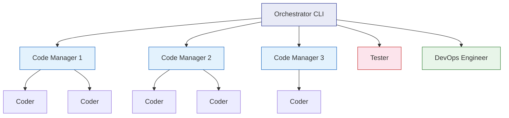
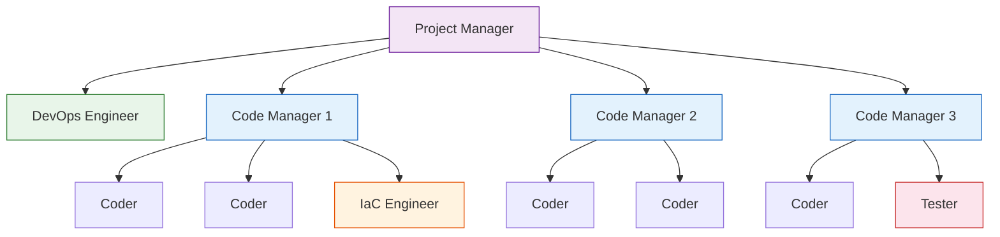

# Agent Persona Hierarchy

The agentic architecture supports two modes: Standard (flat) and Project Manager (hierarchical).

## Standard Mode

## Project Manager Mode

## Persona Capabilities

| Persona | Role | Dispatch Context |
|---------|------|-----------------|
| **Project Manager** | Orchestrates code managers, background DevOps | PM mode only |
| **DevOps Engineer** | CI/CD, infrastructure, repo config | Background task |
| **Code Manager** | Plans, dispatches, reviews a batch of issues | Manages N coders |
| **Coder** | Implements a single issue in a worktree | Isolated branch |
| **IaC Engineer** | Infrastructure-as-code (Terraform, Bicep) | Specialized coder |
| **Tester** | Evaluates PR quality, provides feedback | Review gate |
