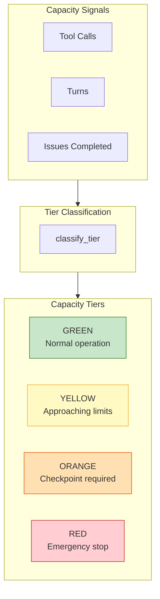
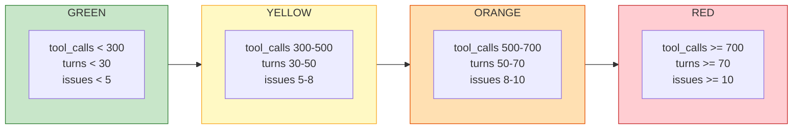

# Capacity Signal Model

The four-tier context capacity model prevents context overflow and ensures clean shutdowns.

## Tier Thresholds

## Phase-Specific Gate Actions

| Phase | GREEN | YELLOW | ORANGE | RED |
|-------|-------|--------|--------|-----|
| 1 (Triage) | PROCEED | PROCEED | CHECKPOINT | EMERGENCY_STOP |
| 2 (Plan) | PROCEED | PROCEED | CHECKPOINT | EMERGENCY_STOP |
| 3 (Dispatch) | PROCEED | SKIP_DISPATCH | CHECKPOINT | EMERGENCY_STOP |
| 4 (Collect) | PROCEED | PROCEED | CHECKPOINT | EMERGENCY_STOP |
| 5 (Merge) | PROCEED | PROCEED | CHECKPOINT | EMERGENCY_STOP |
