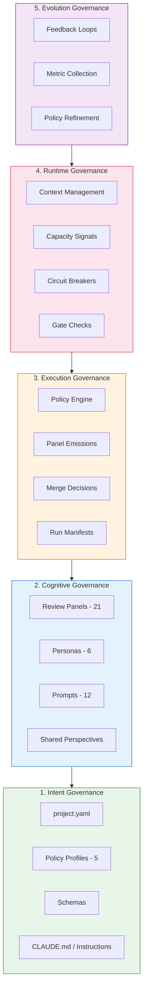

# Governance Layers

The Dark Factory governance architecture consists of five layers, each building on the one below.

## Layer Descriptions

| Layer | Purpose | Key Artifacts |
|-------|---------|---------------|
| **Intent** | Define what governance means for this project | project.yaml, policy profiles, schemas |
| **Cognitive** | Shape how AI agents think about code | Review prompts, personas, shared perspectives |
| **Execution** | Make deterministic merge decisions | Policy engine, panel emissions, run manifests |
| **Runtime** | Keep agents within resource bounds | Context tiers, gate checks, circuit breakers |
| **Evolution** | Improve governance over time | Feedback loops, metrics, policy refinement |
