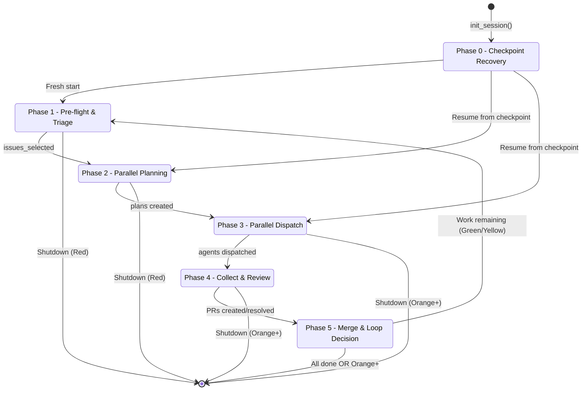
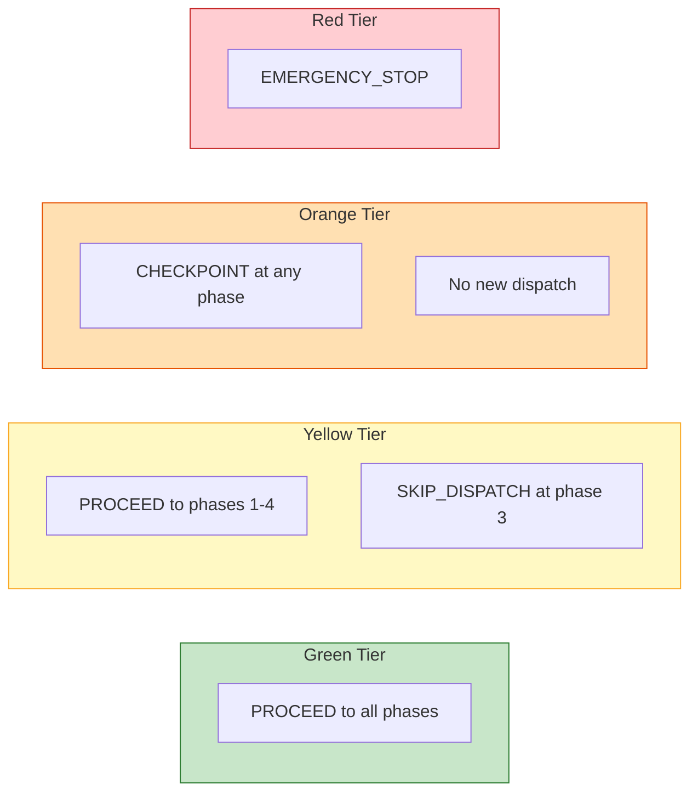

# Orchestrator State Machine

The step-based orchestrator manages 6 phases with capacity-gated transitions.

## Gate Actions by Tier

## Phase Outputs

| Phase | Outputs Expected | Next Phase |
|-------|-----------------|------------|
| 0 | Resume phase | 1 (fresh) or N (resume) |
| 1 | issues_selected | 2 |
| 2 | plans | 3 |
| 3 | dispatched_task_ids | 4 |
| 4 | prs_created, prs_resolved | 5 |
| 5 | merged_prs | 1 (loop) or done |
