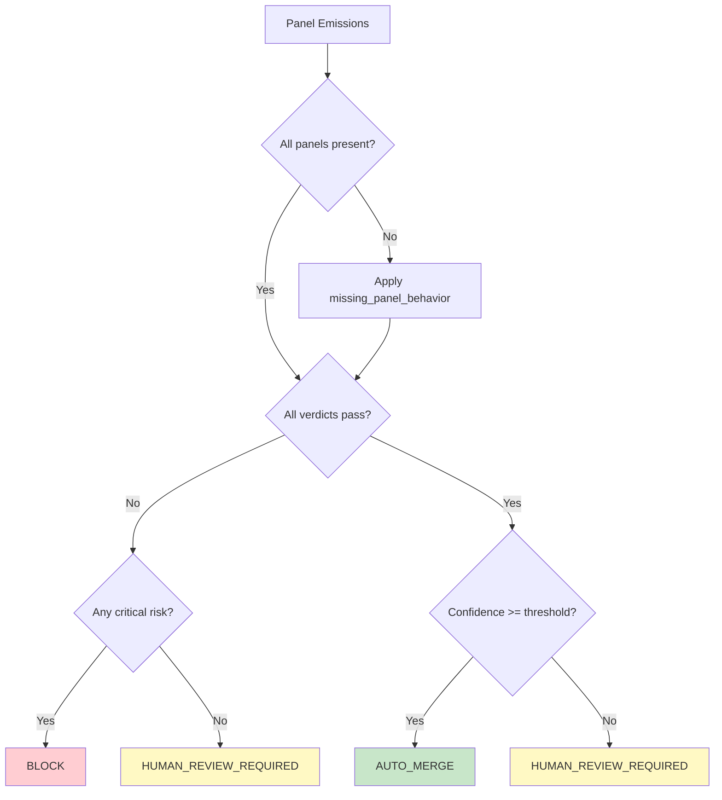

# Policy Engine Flow

The policy engine produces deterministic merge decisions from structured panel emissions.

```mermaid
flowchart LR
    subgraph Panels["Review Panels (21)"]
        P1[code-review]
        P2[security-review]
        P3[threat-modeling]
        P4[documentation-review]
        P5[cost-analysis]
        P6[data-governance]
        P7[..."15 more"]
    end

    subgraph Engine["Policy Engine"]
        V[Schema Validation]
        W[Weighted Aggregation]
        R[Risk Aggregation]
        D[Decision Matrix]
    end

    subgraph Decisions["Merge Decisions"]
        AM[auto_merge]
        HR[human_review_required]
        BL[block]
        AR[auto_remediate]
    end

    Panels --> V
    V --> W
    V --> R
    W --> D
    R --> D
    D --> Decisions

    style AM fill:#c8e6c9,stroke:#2e7d32
    style HR fill:#fff9c4,stroke:#f9a825
    style BL fill:#ffcdd2,stroke:#c62828
    style AR fill:#e3f2fd,stroke:#1565c0
```

## Decision Matrix



## Confidence Weighting (Default Profile)

| Panel | Weight |
|-------|--------|
| code-review | 0.18 |
| security-review | 0.18 |
| ai-expert-review | 0.12 |
| architecture-review | 0.12 |
| testing-review | 0.08 |
| copilot-review | 0.08 |
| documentation-review | 0.05 |
| threat-modeling | 0.05 |
| data-governance-review | 0.05 |
| performance-review | 0.05 |
| cost-analysis | 0.02 |
| finops-review | 0.02 |
