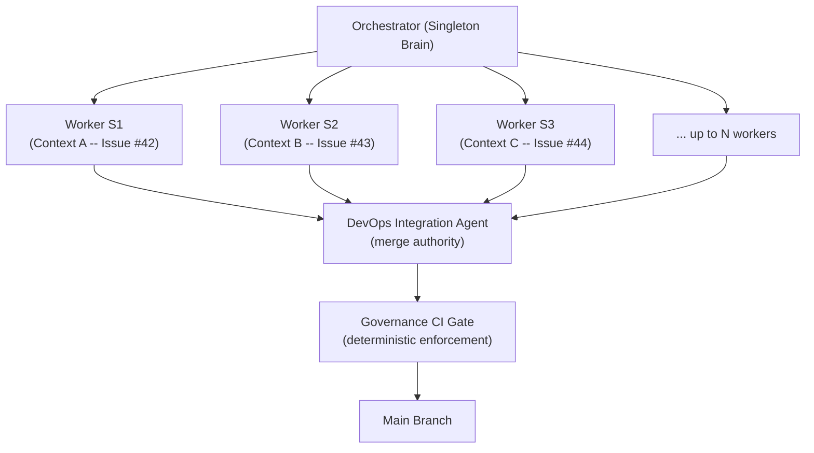
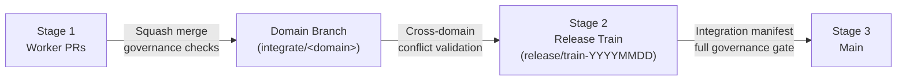

# Mass Parallelization Model

## Overview

The Dark Factory Mass Parallelization Model enables multiple AI agent sessions to work simultaneously on different issues, coordinated through an orchestrator with deterministic governance enforcement. This is Phase 5e — Scalable Policy-Bound Autonomy.

## Architecture



**Key principle:** Context is isolated for cognition, shared only via structured artifacts. No giant agent handling multiple tasks in a shared context.

## Components

### Orchestrator (Singleton)

The orchestrator decomposes Design Intents into Task Contracts and manages worker sessions.

**Responsibilities:**
- DI decomposition into independent tasks
- Dependency graph creation
- Collision domain detection
- Session spawn authorization
- Status tracking
- Manifest aggregation

**Configuration:** [`governance/schemas/orchestrator-config.schema.json`](../../governance/schemas/orchestrator-config.schema.json)

### Workers (N Isolated Sessions)

Each worker operates in complete isolation:
- Single issue per session
- Single branch per session
- Single cognitive context (no cross-session state)
- No direct merge authority — creates PRs for the DevOps agent

**Lifecycle:** `pending → active → governance_review → ready_for_integration → integrated → closed`

### DevOps Integration Agent

Owns all merge operations. Workers never merge directly.

**Responsibilities:** Rebase operations, merge sequencing, conflict resolution, integration branch hygiene, manifest finalization.

**Configuration:** [`governance/policy/integration-strategy.yaml`](../../governance/policy/integration-strategy.yaml)

### Governance CI

Stateless, deterministic enforcement. Validates structured emissions, policy decisions, conflict schemas, and manifests.

## Governance Layer Alignment

| Layer | Parallelization Role |
|-------|---------------------|
| **Intent** | Orchestrator decomposes DI into Task Contracts |
| **Cognitive** | Worker isolation — each worker has independent reasoning context |
| **Execution** | DevOps Integration Agent manages merge sequencing |
| **Runtime** | Drift detection triggers new worker sessions |
| **Evolution** | Autonomy metrics track parallel efficiency |

## Collision Domains

Collision domains group related paths to reduce merge risk. Workers in the same domain are limited by `max_per_collision_domain`.

| Domain | Paths | Max Workers | Risk |
|--------|-------|-------------|------|
| policy-core | `governance/policy/**`, `governance/schemas/**` | 1 | Critical |
| panel-definitions | `governance/prompts/reviews/**`, `governance/personas/agentic/**` | 1 | High |
| workflows | `.github/workflows/**`, `config.yaml` | 1 | High |
| bootstrap | `init.sh`, `init.ps1`, `instructions/**` | 1 | High |
| persona-catalog | `governance/personas/agentic/**` | 2 | Medium |
| prompts | `governance/prompts/**` | 2 | Medium |
| documentation | `docs/**`, `README.md`, etc. | 3 | Low |
| templates | `governance/templates/**` | 3 | Low |

**Configuration:** [`governance/policy/collision-domains.yaml`](../../governance/policy/collision-domains.yaml)

## Integration Strategy

Three-stage integration reduces conflict risk:



**Configuration:** [`governance/policy/integration-strategy.yaml`](../../governance/policy/integration-strategy.yaml)

## Manifest Aggregation

Each worker emits an individual run manifest. The DevOps Integration Agent aggregates these into an integration manifest.

**Worker manifest:** `governance/manifests/run-<task-id>.json` (per [`run-manifest.schema.json`](../../governance/schemas/run-manifest.schema.json))

**Integration manifest:** `governance/manifests/integration-<release-id>.json` (per [`integration-manifest.schema.json`](../../governance/schemas/integration-manifest.schema.json))

The integration manifest records:
- All worker run references
- Aggregate confidence (minimum of all workers — weakest-link model)
- Conflicts detected and how they were resolved
- Final integration decision (merge/hold/reject/partial)
- Parallel efficiency metric

## Scaling Rules

```yaml
session_limits:
  max_total: 8
  max_per_collision_domain: 2
  max_policy_core_sessions: 1

spawn_rules:
  only_spawn_if:
    - no_unresolved_conflict_in_domain
    - governance_ci_green
    - no_blocking_high_risk_sessions
```

## Failure Containment

When a worker fails:
1. Orchestrator marks the session as failed
2. DevOps Integration Agent does not integrate the worker's output
3. Individual run manifest logs the failure
4. Autonomy metrics updated (parallel_efficiency decreases)
5. Other workers are unaffected (isolation guarantees)

## Autonomy Metrics

`parallel_efficiency = completed_sessions / max_concurrent_sessions`

Tracked weekly alongside other autonomy metrics defined in [`docs/operations/autonomy-metrics.md`](../operations/autonomy-metrics.md).

## Builds On

| Artifact | Phase | Purpose |
|----------|-------|---------|
| [`conflict-detection.schema.json`](../../governance/schemas/conflict-detection.schema.json) | 5d | Records agent conflicts |
| [`merge-sequencing.yaml`](../../governance/policy/merge-sequencing.yaml) | 5d | PR ordering rules |
| [`parallel-session-protocol.yaml`](../../governance/policy/parallel-session-protocol.yaml) | 5d | Session lifecycle and coordination |

## Limitations

- **Runtime blocked:** All artifacts are governance configurations. Runtime execution requires a multi-agent orchestrator capable of spawning parallel AI sessions, which does not exist in current tooling (Claude Code, GitHub Copilot are single-session).
- **Single-session fallback:** When `max_concurrent_sessions: 1` or no orchestrator is present, the system degenerates to the existing `startup.md` sequential workflow.
