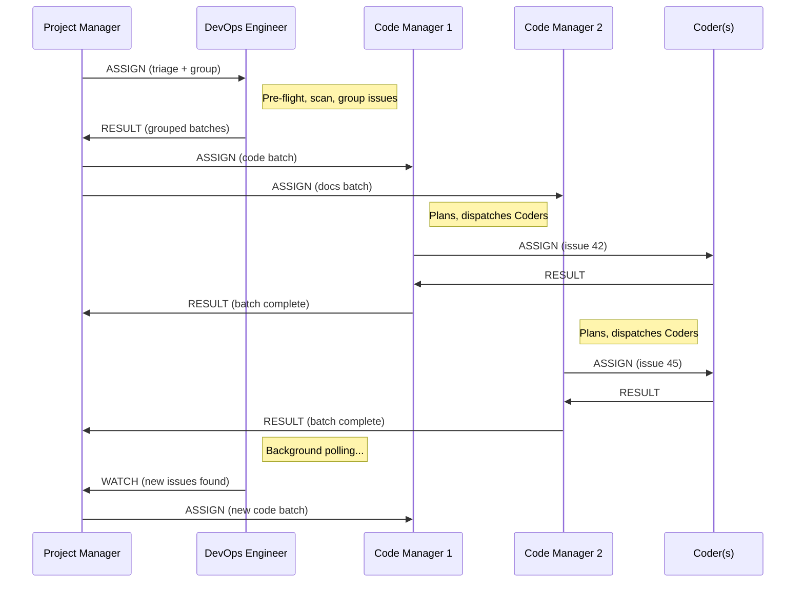

# Project Manager Architecture

## Overview

The Project Manager (PM) is an optional portfolio-level orchestrator that sits above the DevOps Engineer and Code Manager in the Dark Factory agent hierarchy. It enables **multiplexed Code Managers** — running multiple Code Managers concurrently, each processing a batch of related issues — for higher throughput on repositories with many open issues.

## Activation

Set `governance.use_project_manager: true` in `project.yaml`. When absent or `false`, the standard pipeline operates unchanged.

```yaml
governance:
  use_project_manager: true
  parallel_code_managers: 3    # max concurrent Code Managers (default 3)
  parallel_coders: 6           # per Code Manager (default 5)
```

## Agent Hierarchy

### Standard Mode (default)

```
DevOps Engineer (entry point)
  └── Code Manager
        ├── Coder 1
        ├── Coder 2
        ├── ...
        ├── Coder N
        ├── IaC Engineer (conditional)
        └── Tester
```

### PM Mode (opt-in)

```
Project Manager (entry point)
  ├── DevOps Engineer (background — polling)
  ├── Code Manager 1 (batch: code issues)
  │     ├── Coder 1.1
  │     ├── Coder 1.2
  │     └── Tester
  ├── Code Manager 2 (batch: docs issues)
  │     ├── Coder 2.1
  │     └── Tester
  └── Code Manager M (batch: infra issues)
        ├── IaC Engineer
        └── Tester
```

## Data Flow



## Issue Grouping

The DevOps Engineer groups issues by change type before returning them to the PM:

| Group Type | Detection Signals | Typical Work |
|-----------|-------------------|-------------|
| `code` | Labels: `bug`, `feature`, `enhancement` | Feature implementations, bug fixes |
| `docs` | Labels: `documentation` | Documentation updates |
| `infra` | Labels: `infrastructure`, `devops` | IaC changes, pipeline updates |
| `security` | Labels: `security`, `vulnerability` | Security fixes, policy updates |
| `mixed` | Multi-category or unclassifiable | Cross-cutting changes |

Rules:
- Each issue belongs to exactly one group
- Multi-category issues default to `mixed`
- Maximum 20 issues per group (split if exceeded)
- Single-issue groups are valid

## Background Polling

The DevOps Engineer runs in a continuous polling loop after the initial triage:

1. Poll every 2 minutes for new actionable issues
2. Apply standard filters (no existing branch, no blocking labels, etc.)
3. Deduplicate against previously reported issues
4. Group new issues and emit WATCH to PM
5. Continue until CANCEL received

## Context Management

### Nested Parallelism Budget

Total concurrent agents = M (Code Managers) x N (Coders per CM) + 1 (DevOps background).

Example with defaults: 3 Code Managers x 6 Coders = 18 Coders + 1 DevOps = 22 concurrent agents.

Each agent runs in its own context window via `Task` tool with worktree isolation, so the PM's main context is used only for coordination.

### Capacity Tiers for PM

The PM uses the standard four-tier capacity model with PM-specific signals:

| Tier | Action |
|------|--------|
| Green | Normal — spawn Code Managers, process WATCH |
| Yellow | No new CM dispatches — wait for in-flight CMs |
| Orange | CANCEL all CMs, checkpoint, request /clear |
| Red | Emergency CANCEL, immediate checkpoint |

## CANCEL Propagation

```
Project Manager
  ├── CANCEL → DevOps Engineer (stops polling)
  ├── CANCEL → Code Manager 1
  │     ├── CANCEL → Coder 1.1
  │     ├── CANCEL → Coder 1.2
  │     └── CANCEL → Tester
  └── CANCEL → Code Manager 2
        ├── CANCEL → Coder 2.1
        └── CANCEL → Tester
```

CANCEL flows strictly downward. Each agent commits partial work and emits a partial RESULT before stopping.

## Checkpoint Schema

PM-mode checkpoints extend the standard schema with:

```json
{
  "project_manager_mode": true,
  "parallel_code_managers": 3,
  "code_managers": [
    {
      "id": "cm-1",
      "group_type": "code",
      "issues": ["#42", "#43"],
      "status": "completed|active|failed",
      "prs_merged": ["#100"],
      "current_phase": "Phase 4"
    }
  ],
  "watch_queue": [
    {
      "poll_timestamp": "ISO-8601",
      "groups": [{"group_type": "code", "issue_numbers": [50, 51]}]
    }
  ],
  "devops_polling_active": true
}
```

## Cross-Batch Dependencies

If two Code Managers modify the same files:

1. The PM detects the conflict when collecting results
2. The later batch is held until the earlier one merges
3. The held CM is instructed to rebase and continue

This is advisory in the initial implementation — detected but not blocked.

## Failure Handling

| Failure | PM Action |
|---------|-----------|
| DevOps Engineer crashes | Single restart attempt, then escalate to human |
| Code Manager crashes | Log failure, queue batch for next session, continue with others |
| Code Manager times out | Emit CANCEL, wait for partial RESULT, queue remainder |
| All Code Managers fail | Escalate to human with failure summary |
| WATCH messages accumulate | Queue overflow warning at 10+ queued, escalate at 20+ |

## Backward Compatibility

- PM mode is **opt-in** — `governance.use_project_manager` defaults to `false`
- Standard pipeline (Phases 0-5) is completely unchanged when PM is disabled
- Agent protocol additions (WATCH message, PM routes) are backward-compatible — they are only exercised when PM is active
- Existing `parallel_coders` setting continues to control per-CM Coder dispatch
- New `parallel_code_managers` setting has no effect when PM is disabled

## Configuration Reference

| Key | Type | Default | Description |
|-----|------|---------|-------------|
| `governance.use_project_manager` | boolean | `false` | Enable PM-multiplexed pipeline |
| `governance.parallel_code_managers` | integer | `3` | Max concurrent Code Managers (PM mode only) |
| `governance.parallel_coders` | integer | `5` | Max concurrent Coders per Code Manager |

## Related Files

- `governance/personas/agentic/project-manager.md` — PM persona definition
- `governance/personas/agentic/devops-engineer.md` — DevOps Engineer (background mode)
- `governance/personas/agentic/code-manager.md` — Code Manager (batch-scoped mode)
- `governance/prompts/agent-protocol.md` — Agent protocol (WATCH message type, PM routes)
- `governance/prompts/startup.md` — Startup phases (PM mode section)
