# Runtime Feedback Architecture -- Phase 5 Preparation

**Status:** Design Document (No Full Implementation Required)
**Phase:** 5 -- Runtime-Aware Governance
**Depends On:** Phase 4 (Policy-Bound Autonomy), Structured Panel Emissions, Policy Engine, Version Manifests
**Last Updated:** 2026-02-20

---

## Table of Contents

1. [Overview](#overview)
2. [Runtime Anomaly Input Channel](#1-runtime-anomaly-input-channel)
3. [Incident to Design Intent Generator](#2-incident-to-design-intent-di-generator)
4. [Automatic Panel Re-execution](#3-automatic-panel-re-execution)
5. [Drift Detection Model](#4-drift-detection-model)
6. [Cross-Cutting Concerns](#cross-cutting-concerns)
7. [Migration Path](#migration-path)

---

## Overview

Phase 4 establishes deterministic merge gating: Design Intents are submitted, panels execute, structured JSON emissions are evaluated by the policy engine, and merge decisions are rendered. This is a forward-looking, pre-merge system. It does not account for what happens after code reaches production.

Phase 5 closes this loop. Runtime signals -- errors, latency degradation, security anomalies, SLA violations, configuration drift -- are fed back into the governance pipeline, generating new Design Intents, triggering panel re-execution, and updating policy baselines. The system becomes self-correcting within defined bounds.

This document specifies the architecture for that feedback mechanism. It is designed to integrate with the existing persona/panel/policy stack without requiring structural changes to those components.

### Design Principles

- **Determinism preserved.** Runtime signals produce structured inputs. The policy engine evaluates them identically to human-submitted DIs.
- **No vendor lock-in.** Integration points are defined as interfaces, not product bindings.
- **Bounded autonomy.** Automatic remediation operates within configurable thresholds. Escalation to human review is a first-class path, not a fallback.
- **Auditability.** Every runtime-triggered action produces a manifest entry traceable to the originating signal.

### System Context Diagram

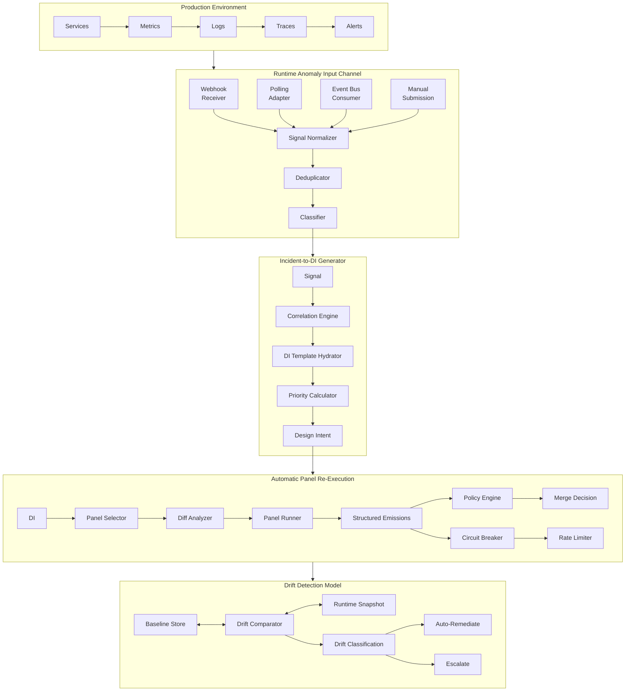

---

## 1. Runtime Anomaly Input Channel

### Purpose

Provide a single, normalized ingestion path for all runtime signals that may require governance action. This channel sits between observability infrastructure and the governance pipeline. It does not replace monitoring or alerting systems; it consumes their outputs.

### Signal Sources

The channel accepts signals from four ingestion modes. Each mode serves a different integration pattern; all converge on the same internal representation.

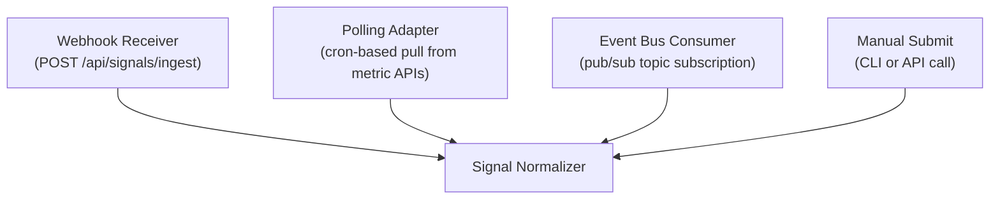

#### 1. Webhook Receiver

External systems push signals via HTTP POST to a well-known endpoint. This is the primary integration mode for alerting systems, APM tools, and CI/CD pipelines.

**Endpoint:** `POST /api/signals/ingest`

**Authentication:** HMAC-SHA256 signature verification using a shared secret per source. The secret is stored in the governance secrets vault, never in repository configuration.

**Rate limit:** 100 requests/second per source, 1000 requests/second aggregate. Excess requests receive HTTP 429 with a `Retry-After` header.

#### 2. Polling Adapter

For systems that do not support outbound webhooks, a polling adapter queries external APIs on a configurable interval. Each adapter is defined as a YAML configuration file.

**Location:** `governance/policy/signal-adapters/`

**Polling interval:** Configurable per adapter. Minimum 30 seconds. Default 60 seconds.

**Example adapter configuration:**

```yaml
adapter_name: "metrics-api-poller"
adapter_version: "1.0.0"
source_type: "polling"
endpoint: "${METRICS_API_BASE_URL}/api/v1/alerts/active"
auth_method: "bearer_token"
auth_secret_ref: "metrics-api-token"
polling_interval_seconds: 60
timeout_seconds: 10
retry_count: 3
retry_backoff_base_seconds: 2
signal_mapping:
  severity: "$.alert.severity"
  category: "$.alert.labels.category"
  component: "$.alert.labels.service"
  message: "$.alert.annotations.summary"
  timestamp: "$.alert.startsAt"
```

#### 3. Event Bus Consumer

For event-driven architectures, the channel subscribes to a message topic. This supports at-least-once delivery; deduplication is handled downstream.

**Topic pattern:** `governance.signals.ingest`

**Consumer group:** `dark-factory-governance`

**Message format:** Same as the normalized signal schema (see below).

#### 4. Manual Submission

Operators and on-call engineers can submit signals directly via CLI or API. This serves as the escape hatch when automated detection fails or when a human identifies an issue that instrumentation has not yet captured.

**CLI example:**

```bash
df-governance signal submit \
  --severity critical \
  --category security \
  --component auth-service \
  --message "Credential stuffing attack detected manually" \
  --source manual \
  --submitter "oncall:jsmith"
```

### Signal Classification Schema

Every signal, regardless of ingestion mode, is normalized to the following schema before entering the pipeline.

**Schema location:** `governance/schemas/runtime-signal.schema.json`

```json
{
  "$schema": "https://json-schema.org/draft/2020-12/schema",
  "title": "RuntimeSignal",
  "type": "object",
  "required": [
    "signal_id",
    "timestamp",
    "source",
    "severity",
    "category",
    "affected_component",
    "message"
  ],
  "properties": {
    "signal_id": {
      "type": "string",
      "format": "uuid",
      "description": "Unique identifier assigned at ingestion time."
    },
    "timestamp": {
      "type": "string",
      "format": "date-time",
      "description": "ISO 8601 timestamp of when the signal was generated at the source."
    },
    "ingested_at": {
      "type": "string",
      "format": "date-time",
      "description": "ISO 8601 timestamp of when the signal entered the governance pipeline."
    },
    "source": {
      "type": "object",
      "required": ["type", "name"],
      "properties": {
        "type": {
          "type": "string",
          "enum": ["webhook", "polling", "event_bus", "manual"]
        },
        "name": {
          "type": "string",
          "description": "Identifier for the specific source system."
        },
        "adapter_version": {
          "type": "string",
          "description": "Version of the adapter that ingested this signal."
        }
      }
    },
    "severity": {
      "type": "string",
      "enum": ["critical", "high", "medium", "low", "informational"],
      "description": "Severity as classified at ingestion. May be reclassified downstream."
    },
    "category": {
      "type": "string",
      "enum": [
        "error",
        "latency",
        "security",
        "sla_violation",
        "resource_exhaustion",
        "configuration_drift",
        "dependency_failure",
        "data_integrity",
        "compliance_violation",
        "capacity"
      ],
      "description": "Primary classification of the signal."
    },
    "affected_component": {
      "type": "string",
      "description": "Service, module, or infrastructure component affected. Must match a component registered in the governance component registry."
    },
    "affected_components_secondary": {
      "type": "array",
      "items": { "type": "string" },
      "description": "Additional components affected by blast radius."
    },
    "message": {
      "type": "string",
      "description": "Human-readable description of the anomaly."
    },
    "metrics": {
      "type": "object",
      "description": "Quantitative data associated with the signal.",
      "properties": {
        "current_value": { "type": "number" },
        "threshold_value": { "type": "number" },
        "baseline_value": { "type": "number" },
        "deviation_percent": { "type": "number" },
        "duration_seconds": { "type": "integer" }
      }
    },
    "context": {
      "type": "object",
      "description": "Arbitrary key-value context from the source system.",
      "additionalProperties": { "type": "string" }
    },
    "correlation_ids": {
      "type": "array",
      "items": { "type": "string" },
      "description": "Trace IDs, request IDs, or other identifiers for cross-referencing with observability systems."
    },
    "fingerprint": {
      "type": "string",
      "description": "Computed hash used for deduplication. See Deduplication Rules."
    }
  }
}
```

### Severity Classification

Severity is determined by a two-pass process:

1. **Source-assigned severity.** The originating system provides its own severity assessment. This is preserved as-is in the `severity` field during normalization.

2. **Governance-reclassification.** After normalization, the signal passes through the severity reclassifier, which may upgrade or downgrade severity based on governance policy.

**Reclassification rules** are defined in `governance/policy/severity-reclassification.yaml`:

```yaml
reclassification_rules:
  # Security signals are never downgraded
  - condition:
      category: "security"
      source_severity: ["critical", "high"]
    action: "preserve"
    rationale: "Security signals at critical/high are trusted from source."

  # SLA violations inherit the SLA tier severity
  - condition:
      category: "sla_violation"
    action: "map_to_sla_tier"
    mapping:
      tier_1: "critical"    # Customer-facing, revenue-impacting
      tier_2: "high"        # Internal SLA, cross-team dependency
      tier_3: "medium"      # Best-effort SLA
    rationale: "SLA tier determines business impact."

  # Repeated low-severity signals escalate
  - condition:
      severity: "low"
      repeat_count_1h: { gte: 10 }
    action: "escalate"
    new_severity: "medium"
    rationale: "Volume of low-severity signals indicates systemic issue."

  # Signals affecting multiple components escalate
  - condition:
      affected_components_secondary_count: { gte: 3 }
    action: "escalate_by_one"
    rationale: "Blast radius across 3+ components indicates broader impact."
```

### Deduplication and Aggregation Rules

Runtime systems frequently emit redundant or overlapping signals. Without deduplication, the governance pipeline would be overwhelmed with duplicate DIs and panel executions.

#### Fingerprint Computation

Each signal receives a fingerprint computed from:

```
fingerprint = SHA-256(
    category +
    affected_component +
    severity +
    normalize_whitespace(message)[0:256]
)
```

The fingerprint intentionally excludes `timestamp` and `signal_id` so that identical anomalies produce identical fingerprints.

#### Deduplication Window

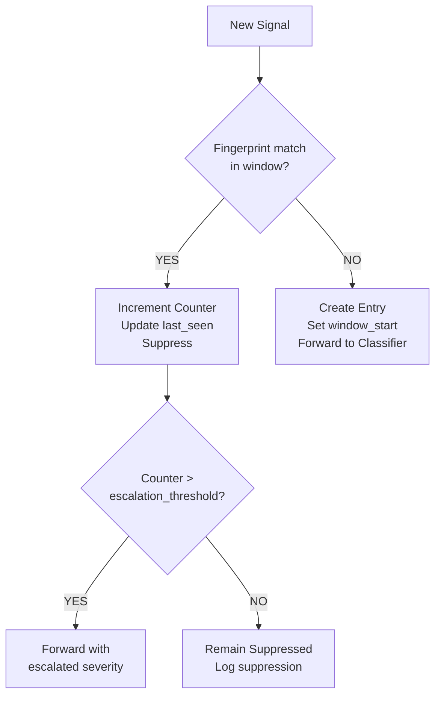

**Deduplication parameters** (configurable in `governance/policy/deduplication.yaml`):

| Parameter | Default | Description |
|---|---|---|
| `window_duration` | 15 minutes | Time window for considering signals as duplicates. |
| `escalation_threshold` | 10 | Number of deduplicated occurrences before re-forwarding with escalated severity. |
| `max_window_duration` | 60 minutes | Maximum deduplication window before forced re-evaluation. |
| `window_reset_on_severity_change` | true | If a duplicate arrives with higher severity, reset window and forward. |

#### Aggregation

Signals that are not exact duplicates but relate to the same incident are aggregated into signal groups. Aggregation uses the following heuristics:

1. **Temporal proximity.** Signals for the same `affected_component` within a 5-minute sliding window.
2. **Blast radius overlap.** Signals whose `affected_components_secondary` sets overlap by 50% or more.
3. **Correlation ID match.** Signals sharing any `correlation_id`.

Aggregated signals produce a single enriched signal with:
- The highest severity from the group.
- The union of all affected components.
- A combined message summarizing constituent signals.
- A reference list of all constituent `signal_id` values.

### Integration Points

The following table defines where observability tools connect to the input channel. The integration is specified by contract, not by product.

| Integration Pattern | Contract | Example Tools (Not Prescriptive) |
|---|---|---|
| Alerting webhook | HTTP POST to `/api/signals/ingest` with HMAC auth | Any alerting system with webhook support |
| Metrics polling | Polling adapter YAML in `governance/policy/signal-adapters/` | Any system exposing a metrics/alerts REST API |
| Log-based signals | Event bus consumer on `governance.signals.ingest` | Any log aggregator with pub/sub forwarding |
| APM/tracing signals | Webhook or polling adapter | Any APM tool with alerting capabilities |
| Custom scripts | CLI `df-governance signal submit` | Runbook automation, cron jobs, ChatOps bots |
| CI/CD pipeline signals | Webhook from pipeline failure/success hooks | Any CI/CD system with webhook support |

---

## 2. Incident to Design Intent (DI) Generator

### Purpose

Transform a classified runtime signal into a Design Intent that the existing governance pipeline can process. The DI Generator bridges the gap between "something went wrong in production" and "the governance system needs to evaluate and potentially act on this."

A Design Intent produced by the DI Generator is structurally identical to a human-submitted DI. The policy engine, panels, and manifest system do not distinguish between the two. The only difference is provenance metadata indicating the DI was machine-generated.

### Architecture

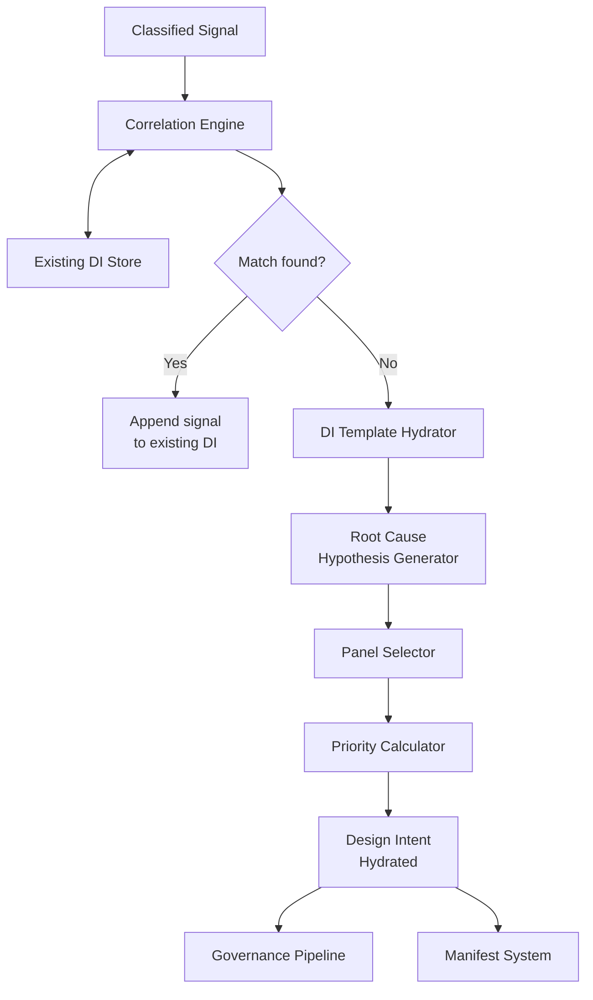

### DI Template Structure

All runtime-generated DIs use the following template. The template ensures that every field required by the policy engine is present and that provenance is fully traceable.

**Template location:** `governance/prompts/templates/runtime-di-template.md`

```markdown
# Design Intent: ${di_title}

## Metadata
- **DI ID:** ${di_id}
- **Generated:** ${timestamp}
- **Origin:** runtime-signal
- **Signal ID(s):** ${signal_ids}
- **Priority:** ${priority}
- **Status:** pending_review

## Affected Component
- **Primary:** ${affected_component}
- **Secondary:** ${affected_components_secondary}
- **Component Owner:** ${component_owner}

## Signal Summary
- **Category:** ${category}
- **Severity:** ${severity}
- **First Detected:** ${first_detected}
- **Last Detected:** ${last_detected}
- **Occurrence Count:** ${occurrence_count}
- **Duration:** ${duration}

## Impact Assessment
- **Blast Radius:** ${blast_radius_description}
- **User Impact:** ${user_impact}
- **SLA Impact:** ${sla_impact}
- **Revenue Impact:** ${revenue_impact_estimate}

## Root Cause Hypothesis
${root_cause_hypothesis}

## Evidence
${evidence_summary}

## Proposed Panel
${proposed_panel}

## Proposed Remediation Class
- **Class:** ${remediation_class}
  - `auto_remediate` -- System can fix without human intervention.
  - `panel_review` -- Panel must evaluate before action.
  - `human_escalation` -- Requires human decision-maker.

## Constraints
${constraints}
```

**Structured emission block** (appended to the Markdown DI):

```json
{
  "di_id": "${di_id}",
  "di_version": "1.0.0",
  "origin": "runtime-signal",
  "signal_ids": ["${signal_id_1}", "${signal_id_2}"],
  "affected_component": "${affected_component}",
  "severity": "${severity}",
  "category": "${category}",
  "priority": ${priority_score},
  "proposed_panel": "${panel_name}",
  "remediation_class": "${remediation_class}",
  "correlation_group_id": "${correlation_group_id}",
  "requires_human_review": ${requires_human_review},
  "generated_at": "${timestamp}",
  "generator_version": "${generator_version}"
}
```

### Correlation with Existing DIs

Before generating a new DI, the correlation engine checks whether an existing DI already addresses the same issue. This prevents the system from spawning redundant governance work.

**Correlation criteria** (evaluated in order; first match wins):

| Criterion | Match Logic | Action |
|---|---|---|
| Signal fingerprint match | New signal fingerprint matches a signal already attached to an open DI. | Append signal to existing DI. Update occurrence count and last_detected. |
| Component + category match | Same `affected_component` and `category` as an open DI created within the last 24 hours. | Append signal to existing DI. Recalculate priority. |
| Correlation ID overlap | New signal shares a `correlation_id` with a signal attached to an open DI. | Append signal to existing DI. Expand blast radius if needed. |
| Root cause similarity | Cosine similarity of root cause hypothesis text exceeds 0.85 against an open DI. | Flag for human review. Do not auto-merge. Present both DIs to reviewer. |
| No match | None of the above criteria are satisfied. | Generate new DI. |

**State transitions for correlated DIs:**

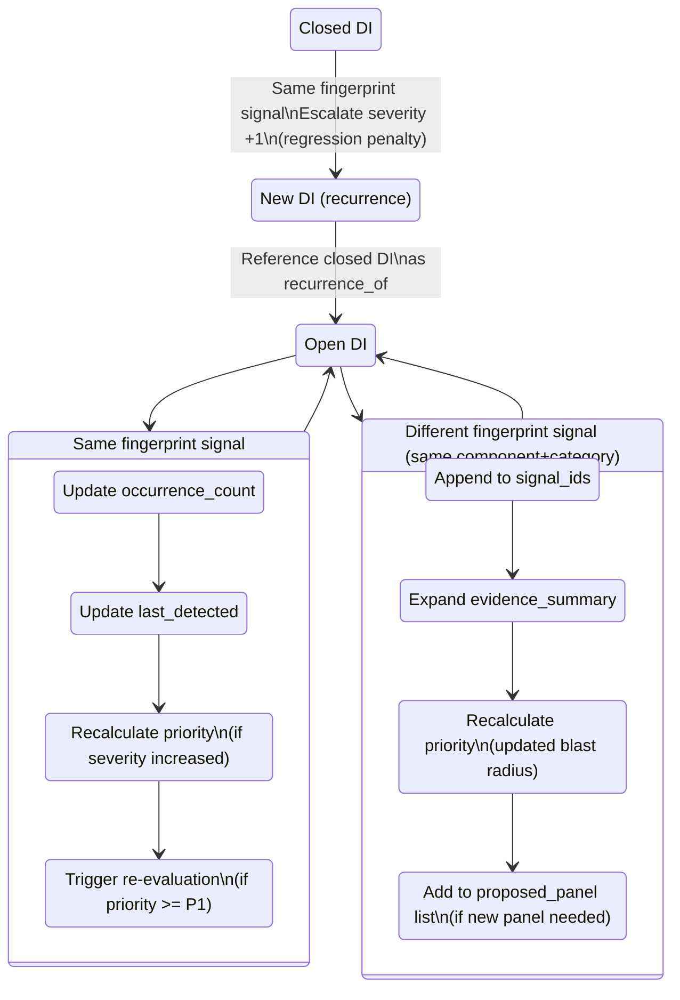

### Root Cause Hypothesis Generation

The DI Generator produces a root cause hypothesis by combining:

1. **Signal category and metrics.** A latency signal with `current_value: 2500ms` and `threshold_value: 500ms` produces: "Response latency for ${component} exceeded threshold by ${deviation_percent}%. Potential causes: resource contention, dependency degradation, or algorithmic regression."

2. **Historical pattern matching.** If the component has experienced the same category of signal before, the generator references prior root cause analyses from closed DIs and post-mortem artifacts.

3. **Dependency graph traversal.** If the component has known upstream dependencies and those dependencies also have active signals, the hypothesis includes: "Correlated signals detected in upstream dependency ${dep_name}. Root cause may originate upstream."

The hypothesis is explicitly labeled as machine-generated and provisional. It exists to give the reviewing panel a starting point, not a conclusion.

### Priority Calculation Model

Priority is a numeric score from 0 (lowest) to 100 (highest), computed deterministically from signal attributes. The policy engine uses this score for queue ordering and escalation decisions.

```
priority = (severity_weight * 0.35)
         + (blast_radius_weight * 0.25)
         + (sla_impact_weight * 0.20)
         + (recurrence_penalty * 0.10)
         + (time_decay_bonus * 0.10)
```

**Factor definitions:**

| Factor | Calculation | Range |
|---|---|---|
| `severity_weight` | critical=100, high=75, medium=50, low=25, informational=10 | 10--100 |
| `blast_radius_weight` | `min(100, count(affected_components) * 20)` | 0--100 |
| `sla_impact_weight` | tier_1=100, tier_2=70, tier_3=40, no_sla=10 | 10--100 |
| `recurrence_penalty` | 0 if first occurrence; +20 per recurrence in last 30 days, max 100 | 0--100 |
| `time_decay_bonus` | Signals older than 1 hour lose 5 points per hour, floor 0 | 0--100 |

**Priority-to-label mapping:**

| Score Range | Label | Response Expectation |
|---|---|---|
| 80--100 | P0 | Immediate. Panel execution within 5 minutes. Human notification required. |
| 60--79 | P1 | Urgent. Panel execution within 30 minutes. |
| 40--59 | P2 | Standard. Panel execution within 4 hours. |
| 20--39 | P3 | Low. Panel execution within 24 hours. |
| 0--19 | P4 | Advisory. Queued for next scheduled review cycle. |

---

## 3. Automatic Panel Re-execution

### Purpose

When a runtime signal generates a DI, the relevant review panels must execute to produce structured emissions that the policy engine can evaluate. This section defines which panels execute, under what conditions, and what safeguards prevent runaway execution.

### Trigger Conditions

Panel re-execution is triggered by the following events. Each trigger type maps to a specific panel selection strategy.

| Trigger | Description | Panel Selection Strategy |
|---|---|---|
| `runtime_di_created` | A new DI was generated from a runtime signal. | Use the DI's `proposed_panel` field. |
| `runtime_di_escalated` | An existing DI's priority was recalculated and crossed a threshold boundary (e.g., P2 to P1). | Re-execute all panels from the previous run with updated context. |
| `drift_detected` | The drift detection model identified a deviation exceeding the auto-review threshold. | Use the drift type to panel mapping (see Section 4). |
| `remediation_completed` | An auto-remediation action was taken. Panels must verify the fix. | Re-execute the original panel set plus the production readiness panel. |
| `policy_profile_updated` | A policy profile was modified. Existing open DIs under that profile must be re-evaluated. | Re-execute all panels for open DIs referencing the updated profile. |
| `manual_re_execution` | An operator explicitly requests panel re-execution for a DI. | Use operator-specified panels, or all panels if unspecified. |

### Panel Selection by Signal Type

The DI Generator proposes panels based on signal category. The mapping is defined in `governance/policy/signal-panel-mapping.yaml` and is overridable per policy profile.

```yaml
signal_panel_mapping:
  error:
    primary: "panels/code-review.md"
    secondary:
      - "panels/production-readiness-review.md"
    personas_required:
      - "engineering/debugger.md"
      - "operations/sre.md"
      - "operations/failure-engineer.md"

  latency:
    primary: "panels/performance-review.md"
    secondary:
      - "panels/architecture-review.md"
    personas_required:
      - "engineering/performance-engineer.md"
      - "operations/sre.md"
      - "domain/backend-engineer.md"

  security:
    primary: "panels/security-review.md"
    secondary:
      - "panels/code-review.md"
    personas_required:
      - "compliance/security-auditor.md"
      - "operations/infrastructure-engineer.md"
      - "compliance/compliance-officer.md"

  sla_violation:
    primary: "panels/production-readiness-review.md"
    secondary:
      - "panels/performance-review.md"
    personas_required:
      - "operations/sre.md"
      - "operations/observability-engineer.md"
      - "operations/failure-engineer.md"

  configuration_drift:
    primary: "panels/architecture-review.md"
    secondary:
      - "panels/security-review.md"
    personas_required:
      - "operations/devops-engineer.md"
      - "operations/infrastructure-engineer.md"
      - "compliance/compliance-officer.md"

  dependency_failure:
    primary: "panels/architecture-review.md"
    secondary:
      - "panels/production-readiness-review.md"
    personas_required:
      - "architecture/systems-architect.md"
      - "operations/failure-engineer.md"
      - "operations/sre.md"

  data_integrity:
    primary: "panels/data-design-review.md"
    secondary:
      - "panels/security-review.md"
    personas_required:
      - "domain/data-architect.md"
      - "compliance/compliance-officer.md"
      - "engineering/debugger.md"

  compliance_violation:
    primary: "panels/security-review.md"
    secondary: []
    personas_required:
      - "compliance/compliance-officer.md"
      - "compliance/security-auditor.md"
      - "compliance/accessibility-engineer.md"
    force_human_review: true

  resource_exhaustion:
    primary: "panels/performance-review.md"
    secondary:
      - "panels/production-readiness-review.md"
    personas_required:
      - "operations/sre.md"
      - "operations/infrastructure-engineer.md"
      - "operations/cost-optimizer.md"

  capacity:
    primary: "panels/production-readiness-review.md"
    secondary:
      - "panels/architecture-review.md"
    personas_required:
      - "operations/sre.md"
      - "operations/infrastructure-engineer.md"
      - "operations/cost-optimizer.md"
```

### Diff-Based Re-execution

When a panel is re-executed due to escalation or remediation verification, the system computes a diff against the previous execution context. Only panels whose inputs have materially changed are re-executed.

**Diff computation:**

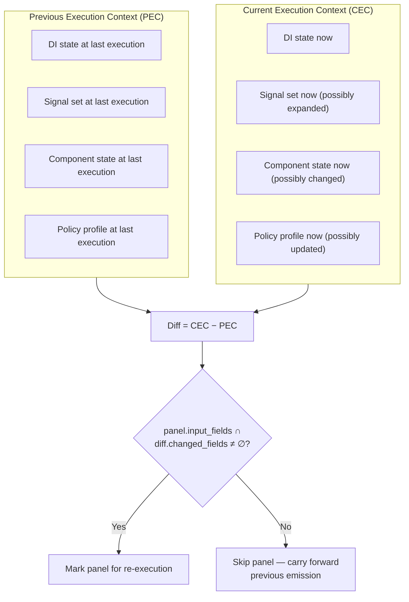

**Panel input field mapping** (which fields each panel type is sensitive to):

| Panel | Sensitive Fields |
|---|---|
| Code Review | `affected_component`, `code_diff`, `error_details` |
| Architecture Review | `affected_component`, `dependency_graph`, `blast_radius` |
| Security Review | `security_context`, `compliance_flags`, `access_patterns` |
| Performance Review | `latency_metrics`, `resource_metrics`, `throughput_metrics` |
| Production Readiness | `deployment_state`, `rollback_capability`, `sla_status` |
| Data Design Review | `data_schema`, `data_flow`, `integrity_constraints` |
| Incident Post-Mortem | `timeline`, `root_cause`, `contributing_factors` |

### Rate Limiting and Circuit Breakers

Automatic panel re-execution introduces the risk of feedback loops: a signal triggers a panel, the panel recommends a remediation, the remediation triggers a new signal, which triggers a new panel. Without safeguards, this cycle can consume unbounded resources.

#### Rate Limiter

The rate limiter operates at three levels:

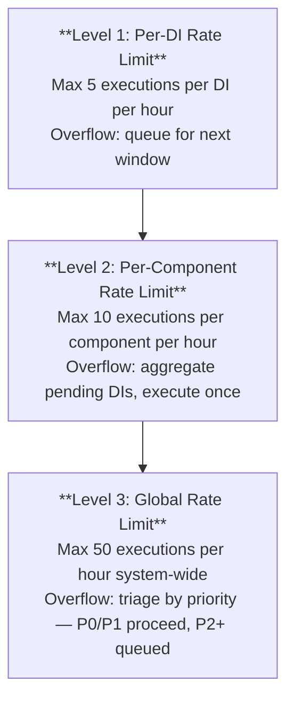

**Configuration location:** `governance/policy/rate-limits.yaml`

```yaml
rate_limits:
  per_di:
    max_executions_per_hour: 5
    max_executions_per_day: 20
    overflow_action: "queue"

  per_component:
    max_executions_per_hour: 10
    max_executions_per_day: 40
    overflow_action: "aggregate_and_execute_once"

  global:
    max_executions_per_hour: 50
    max_executions_per_day: 200
    overflow_action: "triage_by_priority"
    priority_cutoff_when_limited: "P1"
```

#### Circuit Breaker

The circuit breaker prevents infinite remediation loops. It operates as a state machine:

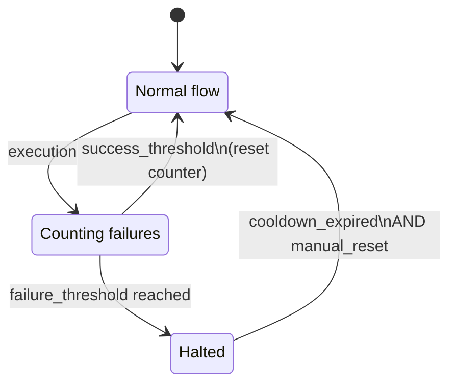

**Circuit breaker parameters:**

| Parameter | Default | Description |
|---|---|---|
| `failure_threshold` | 3 | Consecutive panel executions for the same DI that produce `auto_remediate` without resolving the signal. |
| `success_threshold` | 1 | Successful execution (signal resolved) resets the counter. |
| `cooldown_period` | 30 minutes | Time the circuit remains open before allowing a half-open probe. |
| `max_cooldown_period` | 4 hours | Exponential backoff ceiling. Each consecutive trip doubles the cooldown, up to this max. |
| `open_action` | `human_escalation` | When circuit opens, escalate to human. The system will not attempt further automatic remediation for this DI until the circuit is manually or automatically reset. |

**Configuration location:** `governance/policy/circuit-breaker.yaml`

### Cooldown Periods

Distinct from rate limits and circuit breakers, cooldown periods enforce a minimum gap between re-executions of the same panel for the same DI, regardless of other conditions.

| Priority | Minimum Cooldown |
|---|---|
| P0 | 5 minutes |
| P1 | 15 minutes |
| P2 | 60 minutes |
| P3 | 4 hours |
| P4 | 24 hours |

Cooldown is measured from the completion timestamp of the previous execution, not from the trigger timestamp. This prevents queued executions from firing immediately when the queue drains.

### Execution Flow

The complete re-execution flow, incorporating all safeguards:

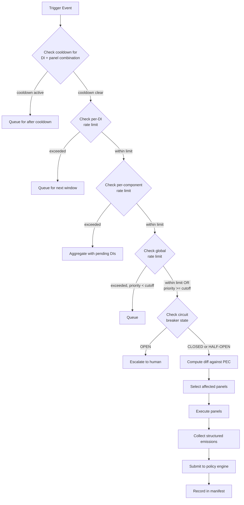

---

## 4. Drift Detection Model

### Purpose

Drift is any divergence between the expected state of a system (as defined by governance artifacts, baselines, and policy) and its actual state at runtime. Drift detection complements the anomaly input channel: where anomalies are event-driven ("something just broke"), drift detection is state-driven ("something has silently changed").

### Drift Categories

Drift is classified into four categories, each with distinct detection methods and remediation paths.

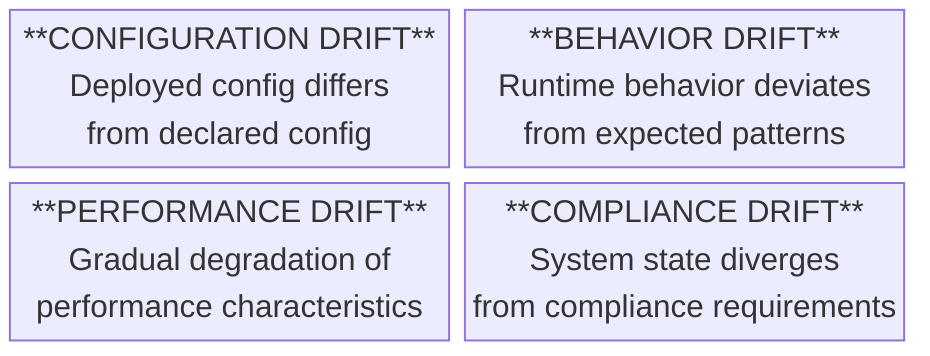

#### 4.1 Configuration Drift

**Definition:** The deployed configuration of a component differs from the configuration declared in version-controlled governance artifacts.

**Detection method:** Periodic comparison of the live configuration snapshot against the last-known-good configuration stored in the manifest system.

**Examples:**
- Environment variables changed outside of the deployment pipeline.
- Feature flags modified directly in a management console without a corresponding DI.
- Infrastructure parameters (instance sizes, replica counts, network rules) altered manually.
- Secret rotation that was not propagated to all dependent services.

**Detection schedule:** Every 15 minutes for critical components; every 60 minutes for standard components.

#### 4.2 Behavior Drift

**Definition:** The observable behavior of a system at runtime deviates from the behavior established during the baseline period, even though no explicit configuration change occurred.

**Detection method:** Statistical comparison of runtime metrics against the established baseline, using rolling windows and standard deviation thresholds.

**Examples:**
- Error rate for a service increases by 2x over a 1-hour window without any deployment.
- A database query that previously completed in 50ms now consistently takes 200ms.
- An API endpoint begins returning a new error code not seen during baseline.
- Memory consumption grows linearly without corresponding traffic increase (potential leak).

**Detection schedule:** Continuous (evaluated on each metrics scrape cycle).

#### 4.3 Performance Drift

**Definition:** Gradual, sustained degradation of performance characteristics that may not trigger threshold-based alerts but represents meaningful erosion of service quality.

**Detection method:** Trend analysis over sliding windows of 24 hours, 7 days, and 30 days. The system looks for statistically significant monotonic trends rather than point-in-time threshold violations.

**Examples:**
- p99 latency increasing by 5% week-over-week for 3 consecutive weeks.
- Throughput capacity declining as data volume grows, indicating sublinear scaling.
- Garbage collection pause times increasing as heap fragmentation accumulates.
- Cache hit ratio declining gradually as working set grows beyond cache capacity.

**Detection schedule:** Evaluated hourly using trailing window aggregates.

#### 4.4 Compliance Drift

**Definition:** The system state diverges from compliance requirements defined in governance policy profiles.

**Detection method:** Policy profile evaluation against current system state. Compliance drift is detected when a system that previously passed a compliance panel review would now fail under the same policy profile without any intentional change.

**Examples:**
- A TLS certificate expires, moving the system out of compliance with encryption-in-transit requirements.
- A dependency receives a CVE, changing the security posture without any code change.
- Data retention policies are violated because a cleanup job silently failed.
- Access control lists have accumulated stale entries that violate least-privilege requirements.

**Detection schedule:** Every 6 hours for critical compliance controls; daily for standard controls.

### Baseline Establishment and Maintenance

Drift detection requires a baseline: the "expected" state against which runtime state is compared. Baselines are established and maintained as follows.

#### Baseline Sources

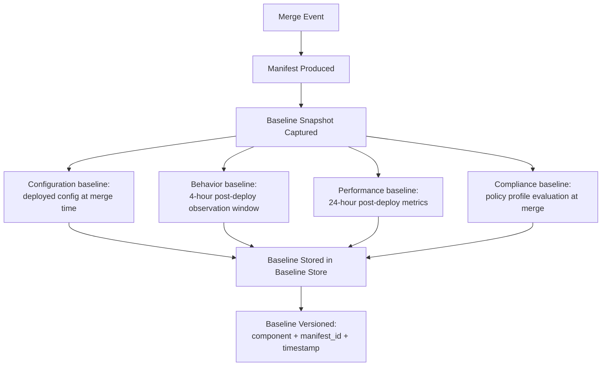

**Baseline store schema:** `governance/schemas/baseline.schema.json`

```json
{
  "baseline_id": "uuid",
  "component": "string",
  "manifest_id": "string -- reference to the merge manifest that established this baseline",
  "established_at": "datetime",
  "baseline_type": "configuration | behavior | performance | compliance",
  "snapshot": {
    "configuration": { "...": "full config snapshot as key-value pairs" },
    "behavior": {
      "error_rate_baseline": "number",
      "latency_p50_baseline": "number",
      "latency_p99_baseline": "number",
      "throughput_baseline": "number",
      "error_codes_observed": ["string"]
    },
    "performance": {
      "latency_p50_24h": "number",
      "latency_p99_24h": "number",
      "throughput_peak_24h": "number",
      "memory_p95_24h": "number",
      "cpu_p95_24h": "number",
      "gc_pause_p99_24h": "number"
    },
    "compliance": {
      "policy_profile": "string",
      "controls_passing": ["string"],
      "controls_not_applicable": ["string"],
      "evaluation_timestamp": "datetime"
    }
  },
  "validity": {
    "valid_until": "datetime -- baselines expire and must be refreshed",
    "superseded_by": "baseline_id or null"
  }
}
```

#### Baseline Refresh

Baselines are not permanent. They are refreshed under the following conditions:

| Condition | Action |
|---|---|
| New merge to the component | Capture new baseline after observation window. Supersede previous baseline. |
| Baseline age exceeds 30 days | Flag baseline as stale. Trigger a background refresh using current production state as the new baseline, provided no active drift alerts exist. |
| Manual refresh requested | Operator triggers a baseline refresh via CLI. The current production state becomes the new baseline. Requires audit justification. |
| Drift resolved | After drift remediation, capture new baseline reflecting the corrected state. |

### Drift Severity Classification

Drift severity is computed from the magnitude of deviation and the criticality of the affected dimension.

```
drift_severity = deviation_magnitude * dimension_criticality
```

**Deviation magnitude** (normalized 0--1):

| Magnitude | Configuration | Behavior | Performance | Compliance |
|---|---|---|---|---|
| 0.0--0.2 | Cosmetic difference (comments, formatting) | Within 1 std dev of baseline | < 5% degradation | Advisory control gap |
| 0.2--0.5 | Non-functional parameter change | 1--2 std dev from baseline | 5--15% degradation | Non-critical control gap |
| 0.5--0.8 | Functional parameter change | 2--3 std dev from baseline | 15--30% degradation | Critical control gap |
| 0.8--1.0 | Security-relevant or breaking change | > 3 std dev from baseline | > 30% degradation | Regulatory control failure |

**Dimension criticality** (configured per component in `governance/policy/component-registry.yaml`):

| Criticality | Score | Description |
|---|---|---|
| Critical | 1.0 | Revenue-impacting, customer-facing, security boundary |
| High | 0.75 | Internal SLA, cross-team dependency |
| Standard | 0.5 | Standard service, limited blast radius |
| Low | 0.25 | Non-production, experimental, internal tooling |

**Resulting drift severity mapping:**

| Drift Score | Severity | Response |
|---|---|---|
| 0.0--0.1 | Informational | Log only. No action. |
| 0.1--0.3 | Low | Create advisory DI. Queue for next review cycle. |
| 0.3--0.5 | Medium | Create DI. Schedule panel execution within standard SLA. |
| 0.5--0.7 | High | Create DI. Trigger panel execution. Notify component owner. |
| 0.7--1.0 | Critical | Create P0 DI. Trigger immediate panel execution. Notify on-call. |

### Remediation Thresholds

The system distinguishes between drift that can be automatically remediated and drift that requires human judgment.

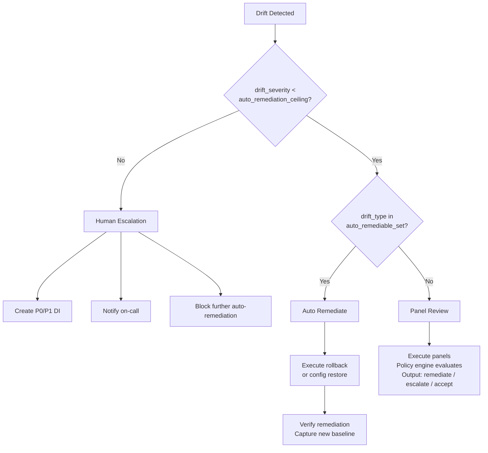

**Auto-remediation ceiling** (configurable in `governance/policy/drift-remediation.yaml`):

```yaml
auto_remediation:
  enabled: true
  ceiling_severity: "medium"  # Drift above this severity requires human review
  allowed_drift_types:
    configuration:
      - "environment_variable_rollback"
      - "feature_flag_restore"
      - "replica_count_restore"
      - "config_file_restore_from_manifest"
    behavior:
      - "restart_unhealthy_instance"
      - "scale_horizontal_within_bounds"
    performance:
      - "cache_flush"
      - "connection_pool_reset"
    compliance:
      # No auto-remediation for compliance drift. Always requires human review.
      []

  prohibited_actions:
    - "data_deletion"
    - "schema_migration"
    - "secret_rotation"
    - "network_rule_modification"
    - "iam_policy_change"

  verification:
    required: true
    verification_window_minutes: 15
    revert_on_verification_failure: true
```

**Human escalation is mandatory when:**

1. Drift severity is above the auto-remediation ceiling.
2. Drift type is not in the `allowed_drift_types` set.
3. The proposed remediation action is in the `prohibited_actions` list.
4. Compliance drift of any severity (compliance drift always requires human review per enterprise policy).
5. The circuit breaker for the component is in OPEN state.
6. The auto-remediation failed verification.

### Integration with the Policy Engine

Drift signals enter the policy engine through the same path as any other DI. The policy engine applies the following additional rules for drift-originated DIs:

**Drift-specific policy rules** (in `governance/policy/drift-policy.yaml`):

```yaml
drift_policy:
  # Drift DIs carry a "drift" tag that the policy engine recognizes
  di_tag: "drift"

  # Drift against a component with an active incident is always escalated
  active_incident_rule:
    condition: "component has active incident DI"
    action: "escalate_to_human"
    rationale: "Drift during an active incident may indicate ongoing attack or cascading failure."

  # Drift that reverses a recent remediation is flagged as regression
  regression_rule:
    condition: "drift fingerprint matches a remediated drift within 7 days"
    action: "escalate_severity_by_one"
    tag: "regression"
    rationale: "Recurring drift indicates remediation was insufficient."

  # Configuration drift for components under change freeze
  change_freeze_rule:
    condition: "component is in change_freeze window"
    action: "block_auto_remediation"
    escalation: "immediate_human_review"
    rationale: "No automated changes during change freeze."

  # Compliance drift generates compliance-specific audit entries
  compliance_audit_rule:
    condition: "drift_type == compliance"
    action: "generate_compliance_audit_entry"
    requires: "compliance-officer persona review"
    manifest_tag: "compliance_drift"

  merge_decision_overrides:
    # Drift-originated DIs cannot produce auto_merge decisions
    # They can only produce: auto_remediate, human_review_required, or block
    allowed_decisions:
      - "auto_remediate"
      - "human_review_required"
      - "block"
    prohibited_decisions:
      - "auto_merge"
    rationale: "Drift is a post-merge concern. 'auto_merge' is not a meaningful response to drift."
```

### Drift Detection Schedule Summary

| Category | Critical Components | Standard Components |
|---|---|---|
| Configuration | Every 15 min | Every 60 min |
| Behavior | Continuous | Continuous |
| Performance | Every 60 min | Every 60 min |
| Compliance | Every 6 hours | Every 24 hours |

> **Baseline Refresh:** After every merge, or when baseline age > 30 days.
> **Stale Baseline Alert:** After 45 days without refresh.

---

## Cross-Cutting Concerns

### Audit Trail

Every action taken by the runtime feedback system produces an audit entry in the manifest system. The following events are logged:

| Event | Manifest Fields |
|---|---|
| Signal ingested | `signal_id`, `timestamp`, `source`, `severity`, `category`, `fingerprint` |
| Signal deduplicated | `signal_id`, `duplicate_of`, `suppression_count` |
| Signal aggregated | `signal_group_id`, `constituent_signal_ids` |
| DI generated | `di_id`, `signal_ids`, `priority`, `proposed_panel` |
| DI correlated with existing | `di_id`, `correlated_di_id`, `correlation_method` |
| Panel execution triggered | `di_id`, `panel_name`, `trigger_type`, `execution_id` |
| Panel execution skipped (diff) | `di_id`, `panel_name`, `reason: no_material_change` |
| Rate limit applied | `di_id`, `limit_level`, `action_taken` |
| Circuit breaker tripped | `di_id`, `component`, `failure_count`, `cooldown_period` |
| Drift detected | `drift_id`, `component`, `drift_type`, `severity`, `baseline_id` |
| Auto-remediation executed | `drift_id`, `remediation_action`, `result` |
| Human escalation triggered | `di_id` or `drift_id`, `reason`, `escalation_target` |

All audit entries include:
- `event_timestamp` (ISO 8601)
- `governance_system_version`
- `policy_profile_active`
- `actor` (system identifier or human identity)

### Security Considerations

1. **Signal authentication.** All webhook sources must authenticate via HMAC-SHA256. Unauthenticated signals are rejected and logged.
2. **Signal integrity.** Signals are immutable after ingestion. The `signal_id` and `fingerprint` are computed at ingestion time and cannot be modified.
3. **Least privilege.** The runtime feedback system has read access to observability data and write access to the DI pipeline. It does not have direct access to production systems. Auto-remediation actions are executed through a separate, privilege-scoped remediation executor.
4. **Secrets management.** Adapter credentials, webhook secrets, and API tokens are stored in the governance secrets vault, referenced by name in configuration files. Secrets never appear in YAML, JSON, or Markdown artifacts.
5. **Rate limiting as security control.** Rate limits protect against denial-of-service through signal flooding, whether malicious or due to misconfigured alerting.

### Failure Modes

| Failure | Impact | Mitigation |
|---|---|---|
| Signal ingestion unavailable | Runtime signals are lost. | Event bus consumer provides at-least-once delivery with replay capability. Webhook receiver returns 503; senders retry. |
| DI Generator fails | Signals accumulate without governance action. | Dead-letter queue for unprocessed signals. Alert after 100 unprocessed signals or 15 minutes of generator downtime. |
| Panel execution fails | DI remains in pending state. | Retry with exponential backoff (3 attempts). After exhaustion, escalate to human. |
| Policy engine unavailable | No merge decisions rendered. | All DIs queue in `pending_policy_evaluation` state. No automatic actions taken. Human notification after 5 minutes of downtime. |
| Baseline store corrupted | Drift detection produces false positives/negatives. | Baseline store is versioned and backed up. Corrupt baselines trigger a full re-establishment from the most recent manifest. |
| Circuit breaker stuck open | Component receives no automatic remediation. | Maximum open duration of 24 hours. After 24 hours, circuit resets to half-open and allows one probe execution. Human notification at each state transition. |

---

## Migration Path

### Phase 5a: Foundation (Implement First)

1. Define `governance/schemas/runtime-signal.schema.json`.
2. Implement the signal normalizer and fingerprint computation.
3. Deploy the webhook receiver with HMAC authentication.
4. Implement deduplication with configurable windows.
5. Create `governance/policy/signal-panel-mapping.yaml` with initial mappings.
6. Implement the DI Generator with template hydration (without root cause hypothesis generation, which requires historical data).

### Phase 5b: Panel Integration

1. Implement diff-based panel re-execution.
2. Deploy rate limiters at all three levels.
3. Implement circuit breaker state machine.
4. Integrate panel execution results back into the DI lifecycle.
5. Add runtime-originated DIs to the manifest system.

### Phase 5c: Drift Detection

1. Implement configuration drift detection against manifest snapshots.
2. Establish baseline capture in the post-merge pipeline.
3. Implement behavior drift detection using statistical comparison.
4. Implement performance drift detection using trend analysis.
5. Implement compliance drift detection using policy profile re-evaluation.
6. Deploy auto-remediation for configuration drift within allowed bounds.

### Phase 5d: Maturation

1. Enable root cause hypothesis generation using historical DI and post-mortem data.
2. Tune deduplication windows, rate limits, and circuit breaker thresholds based on production data.
3. Expand auto-remediation capabilities based on observed drift patterns.
4. Implement the DI correlation similarity model.
5. Produce the Phase 5 autonomy metrics report.

---

## Appendix: File Manifest

The following files are defined or referenced by this architecture. Files marked "new" do not yet exist and must be created during implementation.

| File | Status | Purpose |
|---|---|---|
| `docs/architecture/runtime-feedback.md` | This document | Design specification |
| `governance/schemas/runtime-signal.schema.json` | Implemented (PR #69) | Signal normalization schema |
| `governance/schemas/baseline.schema.json` | Implemented (PR #69) | Baseline snapshot schema |
| `governance/prompts/templates/runtime-di-template.md` | Implemented (PR #89) | DI template for runtime-generated intents |
| `governance/schemas/runtime-di.schema.json` | Implemented (PR #89) | Runtime DI structured emission schema |
| `governance/prompts/di-generation-workflow.md` | Implemented (PR #89) | Agentic workflow for DI generation |
| `governance/policy/severity-reclassification.yaml` | Implemented (PR #69) | Severity reclassification rules |
| `governance/policy/deduplication.yaml` | Implemented (PR #69) | Deduplication window configuration |
| `governance/policy/signal-adapters/` | Implemented (PR #98) | Polling adapter configurations with examples |
| `governance/policy/signal-panel-mapping.yaml` | Implemented (PR #69) | Signal category to panel mapping |
| `governance/policy/rate-limits.yaml` | Implemented (PR #69) | Rate limit configuration |
| `governance/policy/circuit-breaker.yaml` | Implemented (PR #69) | Circuit breaker parameters |
| `governance/policy/drift-remediation.yaml` | Implemented (PR #69) | Drift auto-remediation rules |
| `governance/policy/drift-policy.yaml` | Implemented (PR #69) | Drift-specific policy engine rules |
| `governance/policy/component-registry.yaml` | Implemented (PR #69) | Component criticality and ownership |
| `governance/schemas/remediation-action.schema.json` | Implemented (PR #83) | Remediation action audit record |
| `governance/schemas/remediation-verification.schema.json` | Implemented (PR #83) | Post-remediation verification result |
| `governance/prompts/remediation-workflow.md` | Implemented (PR #83) | Agentic workflow for autonomous drift remediation |
| `governance/schemas/panel-output.schema.json` | Defined in Phase 4 | Structured panel emission schema |
| `governance/schemas/run-manifest.schema.json` | Defined in Phase 4 | Merge manifest schema |
| `governance/prompts/reviews/*.md` | Existing | Consolidated review prompts consumed by re-execution |
| `governance/prompts/workflows/incident-response.md` | Existing | Incident response workflow (input to DI Generator) |
