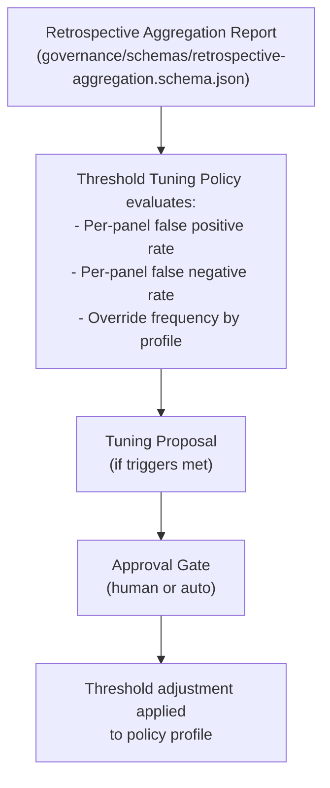

# Threshold Auto-Tuning

## Purpose

The threshold auto-tuning policy (`governance/policy/threshold-tuning.yaml`) defines rules for adjusting governance confidence thresholds based on empirical data from retrospective aggregation reports. It enables the governance system to self-improve by learning from its own decisions — lowering thresholds when panels are too conservative (false positives) and raising them when panels miss issues (false negatives).

## How It Works

### Data Flow

### Trigger Conditions

The policy evaluates panel accuracy data from retrospective aggregation reports. A tuning proposal is generated when:

1. **False positive trigger** — A panel's false positive rate exceeds 15% (with at least 3 absolute false positives). This means the panel is blocking too aggressively. The proposal recommends lowering the panel's weight or the escalation threshold.

2. **False negative trigger** — A panel's false negative rate exceeds 5% (with at least 1 absolute false negative). This means the panel is approving changes that should have been caught. The proposal recommends raising the auto-merge threshold or the panel's weight. False negatives have a lower trigger threshold because they are more dangerous.

### Safety Bounds

All adjustments are constrained by hard bounds to prevent runaway tuning:

| Threshold | Minimum | Maximum | Default |
|-----------|---------|---------|---------|
| Auto-merge confidence | 0.75 | 0.95 | 0.85 |
| Escalation confidence | 0.50 | 0.80 | 0.70 |
| Block confidence | 0.20 | 0.50 | 0.40 |
| Panel weight | 0.02 | 0.35 | varies |

### Cooldown

To prevent oscillation from rapid successive adjustments:

- **Per-panel cooldown**: 30 days between proposals for the same panel
- **Global cooldown**: 7 days between any tuning proposal
- **Post-adjustment observation**: 10 new runs required before re-evaluating an adjusted threshold

### Approval Gates

Three tiers based on the size of the proposed change:

| Delta | Approval Required |
|-------|-------------------|
| <= 0.02 | Auto-applied (no human approval) |
| 0.02 — 0.05 | 1 approval from tech lead or senior engineer |
| > 0.05 | 2 approvals from tech lead + engineering manager |

### Rollback

If a tuning adjustment results in worse outcomes:

- False negative rate increases by >= 0.02 after a threshold decrease -> propose rollback
- False positive rate increases by >= 0.10 after a threshold increase -> propose rollback
- Both rates worsen simultaneously -> auto-revert without approval

## Data Requirements

Before any tuning is considered:

- Minimum **20 governance runs** in the aggregation period
- Minimum **14 days** of data
- Data must come from a **single policy profile** (no cross-profile tuning)

These requirements prevent premature tuning based on insufficient data.

## Relationship to Other Policy Files

| Policy File | Relationship |
|-------------|-------------|
| `default.yaml` | Contains the thresholds (0.85 auto-merge, 0.70 escalation, 0.40 block) that tuning adjusts |
| `fin_pii_high.yaml` | Separate profile with its own thresholds; tuned independently per `single_profile_required` |
| `infrastructure_critical.yaml` | Separate profile with its own thresholds; tuned independently |
| `drift-policy.yaml` | Drift decisions are not subject to auto-tuning (different decision space) |

## Interaction with Governance Change Proposal Workflow

The threshold auto-tuning policy defines _when_ and _how much_ to tune. The actual proposal and application of changes would be handled by the governance change proposal workflow (a separate Phase 5b item). Until that workflow is implemented, tuning proposals are surfaced as GitHub issues for manual review and application.

## Audit Trail

All tuning activity is logged:

- Run manifests include tuning decisions
- GitHub issues are created for each tuning proposal
- Comments are posted on the source retrospective aggregation report
